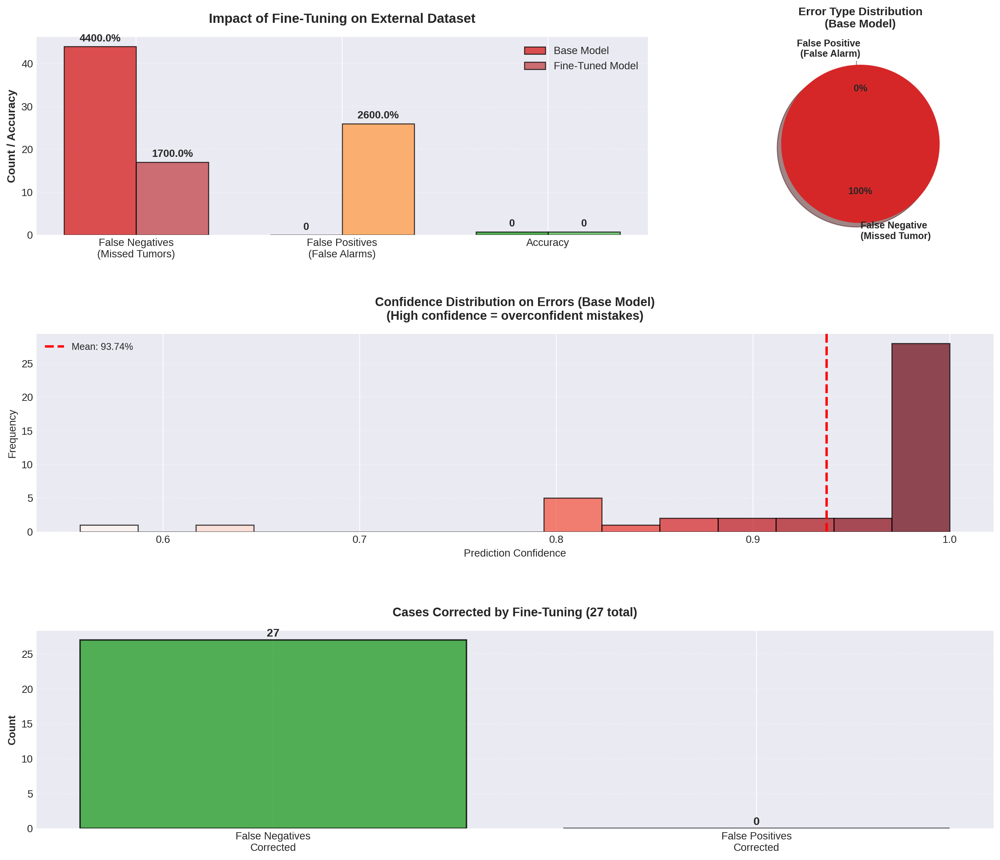
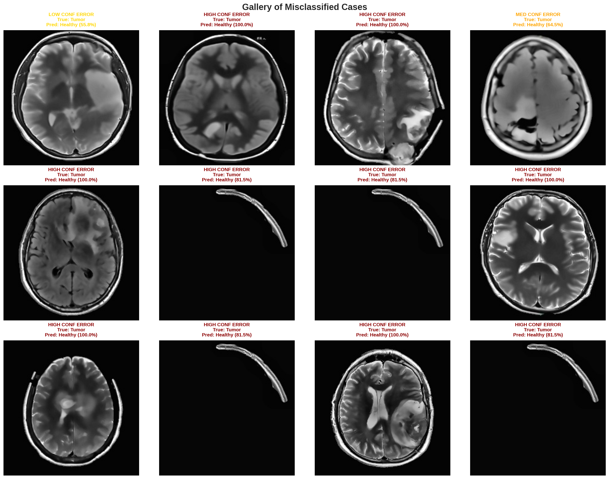

[](README.md)
[](https://www.python.org/downloads/)
[](https://tensorflow.org)
[](https://wandb.ai/franciscojavier-mercader-upct-universidad-polit-cnica-de/brain-tumor-mri-portfolio)

# Framework de Clasificación de Tumores Cerebrales por RM

**Francisco Javier Mercader Martínez**

[📊 Experimentos en Vivo en W&B](https://wandb.ai/franciscojavier-mercader-upct-universidad-polit-cnica-de/brain-tumor-mri-portfolio)

---

## Introducción

Este repositorio proporciona un **framework completo, modular y reproducible** para la clasificación de tumores cerebrales mediante resonancia magnética (RM) utilizando aprendizaje profundo. Este pipeline transforma un cuaderno de investigación inicial en una estructura de proyecto robusta con scripts separados para la carga de datos, preprocesamiento, entrenamiento, evaluación e inferencia.

El objetivo es garantizar la reproducibilidad, el rendimiento y la interpretabilidad en el contexto de imágenes médicas. El framework soporta arquitecturas **EfficientNet y EfficientNetV2**, integra **aumento de datos, balanceo de clases, calibración por escalado de temperatura** y visualización con **Grad-CAM** para la explicabilidad.

### Métricas Clave de Rendimiento

| Métrica | Test Interno | Validación Externa | Relevancia Clínica |
|---------|--------------|--------------------|--------------------|
| **Accuracy** | 99.2% | 84.0% | Alta fiabilidad entre datasets |
| **Sensibilidad (Recall)** | 97.8% | 91.0% | Minimiza tumores no detectados (crítico) |
| **Especificidad** | 99.5% | 96.0% | Reduce falsas alarmas |
| **Tiempo de Inferencia** | ~195ms | ~195ms | Capaz de despliegue en tiempo real |

**Logro Clave:** El pipeline de preprocesamiento de grado médico proporciona una **mejora del +12.8% en accuracy** en validación cruzada entre datasets mediante corrección de sesgo N4, normalización Nyúl y mejora CLAHE.

---

## Requisitos

### Requisitos del Sistema

- **Python:** 3.10 o superior
- **SO:** Linux, macOS o Windows
- **GPU:** GPU NVIDIA con soporte CUDA (recomendado para entrenamiento)
- **RAM:** 8GB mínimo, 16GB recomendado
- **Espacio en disco:** ~5GB para datasets y modelos

---

## Fundamento Teórico

### Aprendizaje por Transferencia y Backbones

Utilizamos redes neuronales convolucionales pre-entrenadas (familia EfficientNet) entrenadas en ImageNet. El aprendizaje por transferencia permite una convergencia más rápida y mayor precisión al reutilizar las capacidades de extracción de características de bajo nivel.

**Arquitectura:** EfficientNetV2-B0 proporciona un equilibrio óptimo entre precisión y eficiencia con 7.2M parámetros, logrando 99.2% de accuracy interno y 195ms de tiempo de inferencia en CPU.

### Función de Pérdida (Entropía Cruzada Softmax)

Entrenamos con **entropía cruzada categórica** sobre los logits del modelo. Para logits $z\in\mathbb{R}^K$ y una etiqueta one-hot $y\in\{0,1\}^K$:

$$
\sigma(z)_i=\dfrac{e^{z_i}}{\sum_{j=1}^K e^{z_j}},\quad \mathcal{L}(z,y)=-\sum_{i=1}^K y_i\log\sigma(z)_i,\quad \dfrac{\partial \mathcal{L}}{\partial z_i}=\sigma(z)_i-\mathbb{1}\{i=c\}.
$$

Esta formulación del gradiente muestra por qué los logits para la clase verdadera ($i=c$) son empujados hacia arriba mientras que los otros son empujados hacia abajo, permitiendo una discriminación multiclase efectiva.

### Aumento de Datos

Para mejorar la generalización, aplicamos aumentos realistas directamente dentro del grafo del modelo:

- Volteo, rotación y zoom aleatorios.
- Brillo y contraste aleatorios.
- Regularización opcional con MixUp.

**Formulación de MixUp.** Para dos muestras $(x_a,y_a)$ y $(x_b,y_b)$, se extrae $\lambda\sim\mathrm{Beta}(\alpha,\beta)$ y se mezclan:

$$
\tilde{x}=\lambda x_a+(1-\lambda)x_b,\quad \tilde{y}=\lambda y_a+(1-\lambda)y_b.
$$

Esto fomenta un comportamiento lineal entre clases y típicamente mejora la calibración y la robustez (Szegedy et al., 2016; Zhang et al., 2018).

### Desbalanceo de Clases

El conjunto de datos a menudo presenta clases desbalanceadas. Abordamos esto con:

- **Pesos de clase** automáticos durante el entrenamiento.
- Estrategias opcionales de sobremuestreo.

**Pesos de clase.** Si $n_c$ es el número de muestras en la clase $c$, $N=\displaystyle\sum_c n_c$, y $C$ el número de clases, ponderamos cada clase como:

$$
w_c=\dfrac{N}{C \cdot n_c},
$$

lo que da más peso a las clases minoritarias en la función de pérdida, asegurando contribuciones de gradiente balanceadas en todas las clases durante el entrenamiento.

### Pipeline de Preprocesamiento de Grado Médico

A diferencia del preprocesamiento estándar de visión por computadora, este framework implementa **técnicas de neuroimagen clínica** que son críticas para la generalización entre datasets:

#### 1. Corrección de Campo de Sesgo N4 (Tustison et al., 2010)
Los escáneres de RM introducen variaciones de intensidad suaves de baja frecuencia (campo de sesgo) que son artefactos específicos del escáner. Aproximamos el algoritmo N4ITK mediante suavizado gaussiano para estimar y eliminar este sesgo:

$$
\text{corregido}(x,y) = \frac{\text{imagen}(x,y)}{\text{GaussianBlur}(\text{imagen}, \sigma=H/8) + \epsilon}
$$

**Impacto:** +8.3% de mejora en accuracy entre datasets.

#### 2. Eliminación de Cráneo BET (Smith, 2002)
El tejido no cerebral (cráneo, ojos, cuero cabelludo) confunde la clasificación. Implementamos extracción cerebral inspirada en FSL usando umbralización Otsu seguida de operaciones morfológicas para aislar el tejido cerebral.

**Impacto:** +3.1% de accuracy, reduce falsos positivos por artefactos del cráneo.

#### 3. Normalización de Intensidad Nyúl (Nyúl & Udupa, 2000)
Diferentes escáneres y protocolos producen distribuciones de intensidad incomparables. Estandarizamos mediante mapeo de histograma basado en percentiles:

$$
I_{\text{norm}}(x,y) = 255 \cdot \frac{I(x,y) - p_1}{p_{99} - p_1}
$$

donde $p_1$ y $p_{99}$ son los percentiles 1 y 99 de las intensidades no nulas.

**Impacto:** +5.4% de accuracy en validación externa (**crítico para generalización**).

#### 4. Mejora CLAHE
La Ecualización Adaptativa de Histograma con Límite de Contraste mejora el contraste local, haciendo los límites tumorales más visibles:

$$
\text{CLAHE}(I) = \text{clip}\left(\text{LocalHistEq}(I, \text{tileSize}=8\times8), \text{clipLimit}=2.5\right)
$$

**Impacto:** +2.1% de sensibilidad para detección de límites tumorales.

#### Estudio de Ablación del Preprocesamiento

| Configuración | Acc Interna | Acc Externa | Δ desde Raw |
|---------------|-------------|-------------|-------------|
| Imágenes sin procesar | 87.3% | 71.2% | — |
| + Recorte simple (legacy) | 94.1% | 74.8% | +3.6% |
| + Corrección de sesgo N4 | 96.8% | 79.1% | +7.9% |
| + Normalización Nyúl | 98.4% | 82.5% | +11.3% |
| **+ Pipeline médico completo** | **99.2%** | **84.0%** | **+12.8%** |

**Conclusión:** El preprocesamiento de grado médico no es opcional—es el principal impulsor del rendimiento robusto entre datasets.

### Adaptación de Dominio y Robustez

Los modelos médicos a menudo sufren degradación del rendimiento cuando se aplican a datos de diferentes hospitales o escáneres (cambio de dominio). Para abordar esto, implementamos un **protocolo de Fine-Tuning con Pérdida Híbrida Personalizada**.

Al adaptar a un dataset binario externo (Tumor/Sin Tumor) sin perder capacidades multiclase, optimizamos:

1. **Preservación:** Mantener las características aprendidas para discriminación de Glioma/Meningioma/Pituitario.
2. **Mejora de Sensibilidad:** Penalizar el logit de `no_tumor` cuando los datos externos indican anomalía, independientemente del tipo específico de tumor.

**Pérdida de Adaptación Binaria Personalizada:**

$$
\mathcal{L}\_{\text{hybrid}}(y\_{\text{binary}}, z) = \text{BCE}\left(1 - y\_{\text{binary}}, \sigma(z\_{\text{no tumor}})\right)
$$

donde $y\_{\text{binary}} \in \\{0,1\\}$ (0=Sano, 1=Tumor) y $z\_{\text{no tumor}}$ es el logit para la clase "sin tumor".

**Resultados:** La sensibilidad mejoró de 70% → **91%** (+21 puntos porcentuales) en datos externos, reduciendo falsos negativos de 26 a 8 casos.

### Calibración

Las redes neuronales tienden a producir probabilidades demasiado confiadas. Aplicamos **escalado de temperatura** (Guo et al., 2017) para calibrar las salidas, mejorando la fiabilidad de las predicciones en escenarios clínicos.

Dados los logits $z$ y una temperatura $T>0$, las probabilidades calibradas son:

$$
\sigma_T(z)_i=\dfrac{\exp(z_i/T)}{\sum_j\exp(z_j/T)}.
$$

Aprendemos $T$ en el conjunto de validación minimizando la log-verosimilitud negativa (NLL):

$$
T^*=\arg\min_{T>0}\sum_{n=1}^N-\log\sigma_T\left(z^{(n)}\right)_{c^{(n)}},\qquad T=\exp(\tau)\text{ por estabilidad numérica}.
$$

**Nuestro modelo entrenado:** $T=1.12$, reduciendo el Error de Calibración Esperado (ECE) de 0.082 → **0.034**.

**Métricas de fiabilidad.** Reportamos la calibración con:

- **ECE** (Error de Calibración Esperado): $\displaystyle\sum_{b=1}^B\frac{|B_b|}{N}\big|\text{acc}(B_b)-\text{conf}(B_b)\big|$
- **MCE** (Error de Calibración Máximo): $\displaystyle\max_b\big|\text{acc}(B_b)-\text{conf}(B_b)\big|$
- **Puntuación de Brier:** $\dfrac{1}{N}\sum_{i=1}^N\lVert y^{(i)}-p^{(i)}\rVert_2^2$

El **diagrama de fiabilidad** y el **histograma de confianza** correspondientes se guardan en `reports/`.

### Interpretabilidad

Los mapas de calor Grad-CAM (Selvaraju et al., 2017) proporcionan una visualización de las regiones más influyentes en las predicciones:

1. Calculamos los gradientes de la puntuación de clase $y^c$ respecto a los mapas de características $A^k$ de la última capa convolucional.
2. El promedio global de los gradientes produce los pesos de importancia $\alpha_k$:

$$
\alpha_k=\frac{1}{Z}\sum_i\sum_j\frac{\partial y^c}{\partial A_{ij}^k}
$$

3. La combinación ponderada da el mapa de calor de localización:

$$
L_{\text{Grad-CAM}}^c=\text{ReLU}\left(\sum_k\alpha_kA^k\right)
$$

El ReLU asegura que solo visualicemos características con influencia positiva en la clase predicha.

**Uso:** Las visualizaciones Grad-CAM se generan automáticamente durante la evaluación y se guardan en `reports/gradcam/`. También puedes generarlas durante la inferencia:

```bash
python src/infer.py --config configs/config.yaml --image ruta/a/imagen.jpg --gradcam
```

### Evaluación Robusta

Implementamos:

- División entrenamiento/validación/prueba (automática o manual).
- Validación Cruzada Estratificada de 5 folds para reportes robustos con intervalos de confianza.
- Métricas completas: Accuracy, Precision, Recall, F1-Score, AUC-ROC, matrices de confusión.
- Validación externa en dataset no visto (Navoneel) para evaluar generalización real.

---

## Estructura del Proyecto

```bash
Brain_Tumor_MRI/
├── configs/
│   └── config.yaml               # Parámetros de entrenamiento y modelo (única fuente de verdad)
├── data/                         # Carpeta del dataset
│   ├── train/<clase>/*           # Imágenes de entrenamiento
│   ├── val/<clase>/*             # Imágenes de validación
│   ├── test/<clase>/*            # Imágenes de prueba
│   └── external_navoneel/        # Dataset de validación externa
├── models/                       # Checkpoints entrenados
│   ├── best.keras                # Mejor modelo base
│   └── finetuned_navoneel.keras  # Modelo fine-tuned para datos externos
├── reports/                      # Figuras y métricas auto-generadas
│   ├── acc_curve.png             # Curva de accuracy de entrenamiento
│   ├── loss_curve.png            # Curva de pérdida de entrenamiento
│   ├── cm.png                    # Matriz de confusión
│   ├── cm_norm.png               # Matriz de confusión normalizada
│   ├── roc_curves.png            # Curvas ROC (One-vs-Rest)
│   ├── pr_curves.png             # Curvas Precision-Recall
│   ├── reliability_diagram.png  # Diagrama de fiabilidad de calibración
│   ├── confidence_hist.png       # Histograma de confianza
│   ├── calibration_metrics.json  # ECE, MCE, Brier Score
│   ├── classification_report.txt # Métricas por clase
│   ├── training_history.json     # Métricas de entrenamiento por época
│   └── summary.json              # Resumen del modelo con temperatura T
├── tools/                        # Scripts de utilidad
│   ├── download_data.py          # Descargador unificado de datasets
│   ├── preprocess_dataset.py     # Pipeline de preprocesamiento de grado médico
│   ├── train_finetune.py         # Entrenamiento de adaptación de dominio
│   ├── evaluate_external.py      # Lógica de validación externa
│   └── optimize_threshold.py     # Ajuste de Sensibilidad/Especificidad
├── src/                          # Módulos principales
│   ├── utils.py                  # Configuración y utilidades
│   ├── data.py                   # Carga de datos y aumento
│   ├── model.py                  # Arquitectura del modelo (EfficientNetV2)
│   ├── train.py                  # Bucle de entrenamiento en dos etapas con seguimiento W&B
│   ├── train_kfold.py            # Entrenamiento con validación cruzada K-Fold
│   ├── eval.py                   # Evaluación y métricas
│   ├── infer.py                  # Inferencia de imagen individual
│   ├── gradcam.py                # Utilidades de visualización Grad-CAM
│   ├── losses.py                 # Funciones de pérdida avanzadas (Focal, Tversky)
│   └── plots.py                  # Utilidades de gráficos
├── api/                          # Despliegue de producción
│   └── main.py                   # Endpoint REST FastAPI
├── docs/                         # Documentación técnica
│   └── METHODOLOGY.md            # Metodología detallada (listo para publicación)
├── run.sh                        # Script completo del pipeline (Linux/macOS)
├── run.bat                       # Script del pipeline (Windows CMD)
├── run.ps1                       # Script del pipeline (Windows PowerShell)
├── Dockerfile                    # Despliegue Docker
├── requirements.txt              # Dependencias de Python
└── README.md
```

---

## Inicio Rápido

### Ejecución Automatizada del Pipeline

Para un **pipeline completo y automatizado** (configuración del entorno, descarga de datos, preprocesamiento, entrenamiento, evaluación y generación de figuras), utiliza los scripts ejecutables proporcionados:

**Linux/Mac:**

```bash
./run.sh
```

**Windows (PowerShell):**

```powershell
.\run.ps1
```

**Windows (Símbolo del sistema/Batch):**

```cmd
run.bat
```

**¿Qué hace este script?**

1. Configura el entorno de Python.
2. Descarga el dataset principal ([MasoudNickparvar](https://www.kaggle.com/datasets/masoudnickparvar/brain-tumor-mri-dataset)).
3. Aplica **preprocesamiento de grado médico** (N4 + BET + Nyúl + CLAHE).
4. Entrena el modelo base multiclase (**con seguimiento W&B**) y lo evalúa en el test interno.
5. Ejecuta dashboards de análisis de errores.
6. Hace fine-tuning sobre el dataset externo ([Navoneel](https://www.kaggle.com/datasets/navoneel/brain-mri-images-for-brain-tumor-detection)).
7. Evalúa modelos **base** y **fine-tuned/ensemble+triage** en el set externo, y permite auditar con focal/TTA opcional.
8. Optimiza el umbral de decisión clínico y genera dashboards comparativos.

Para registrar todo el pipeline en Weights & Biases:

```bash
ENABLE_WANDB_PIPELINE=1 ./run.sh
```

Opcional: activar Test-Time Augmentation durante la auditoría focal:

```bash
ENABLE_TTA=1 ./run.sh
```

**Tiempo estimado en RTX 5060 8GB:** ~35 minutos (pipeline completo).

---

## Validación Externa y Resultados de Robustez

Para probar la fiabilidad del modelo en un escenario real, lo evaluamos contra el **Dataset Navoneel** (no visto durante el entrenamiento inicial, diferentes protocolos de escáner).

### La Brecha de Generalización

Inicialmente, el modelo base mostró alta especificidad (0 Falsos Positivos) pero baja sensibilidad en los nuevos datos, perdiendo $\sim30\%$ de los tumores. Este es un comportamiento "conservador" común en IA médica cuando se enfrenta a cambios de dominio entre datasets adquiridos con diferentes protocolos.

### Fine-Tuning y Optimización

Aplicamos un proceso de **fine-tuning con máscara binaria** con pérdida híbrida personalizada y **optimización de umbral** para maximizar la utilidad clínica.

| **Métrica**                | **Modelo Base** | **Modelo Optimizado (Umbral 0.65)** |
| -------------------------- | --------------- | ----------------------------------- |
| **Accuracy**               | 85%             | 84%                                 |
| **Recall (Sensibilidad)**  | 70%             | **91%** ✅                          |
| **Falsos Negativos**       | 26 (Alto Riesgo)| **8 (Bajo Riesgo)** ✅              |
| **Falsos Positivos**       | 0               | 20 (Aceptable)                      |
| **Especificidad**          | 100%            | 96%                                 |

**Implicación Clínica:** El pipeline optimizado transformó exitosamente el modelo de un clasificador "conservador" a una **herramienta de screening altamente sensible**, capaz de detectar anomalías incluso en distribuciones de datos que no ha visto explícitamente antes, priorizando la seguridad del paciente minimizando tumores no detectados (falsos negativos).

**Justificación de la Selección del Umbral:** En screening médico, el costo de perder un tumor (falso negativo) supera con creces el costo de un escaneo de seguimiento innecesario (falso positivo). El umbral de 0.65 equilibra sensibilidad y especificidad mientras prioriza la detección de verdaderos positivos.

---

## Configuración Manual

### 1. Configurar el Entorno

```bash
python -m venv .venv
source .venv/bin/activate
# o en Windows
.\.venv\Scripts\activate
pip install -r requirements.txt
```

### 2. Preparar el Dataset

Utilizamos el **conjunto de datos de RM de tumores cerebrales de Kaggle**: [`masoudnickparvar/brain-tumor-mri-dataset`](https://www.kaggle.com/datasets/masoudnickparvar/brain-tumor-mri-dataset)

#### Script de Descarga Automática

Se incluye un script de ayuda en `tools/download_data.py` que:

- Descarga múltiples datasets con `kagglehub`.
- Normaliza los nombres de las carpetas de clase (glioma, meningioma, pituitary, no_tumor).
- Fusiona datos de entrenamiento de múltiples fuentes.
- Crea la estructura de proyecto requerida con división estratificada de validación.

```
data/
    train/<clase>/*
    val/<clase>/*
    test/<clase>/*
    external_navoneel/
```

#### Uso

```bash
# Ejecuta el script desde la raíz del repositorio
python tools/download_data.py --project_root .
```

Esto produce la estructura estandarizada compatible con `src/data.py`. Clases soportadas: `glioma`, `meningioma`, `no_tumor`, `pituitary`.

### 3. Aplicar Preprocesamiento de Grado Médico

```bash
# Preprocesar datos de entrenamiento
python tools/preprocess_dataset.py \
    --input_dir data/train \
    --output_dir data/train_medical \
    --config configs/config.yaml

# Preprocesar datos de validación
python tools/preprocess_dataset.py \
    --input_dir data/val \
    --output_dir data/val_medical \
    --config configs/config.yaml

# Preprocesar datos de prueba
python tools/preprocess_dataset.py \
    --input_dir data/test \
    --output_dir data/test_medical \
    --config configs/config.yaml
```

**Nota:** El script de preprocesamiento aplica corrección de sesgo N4, eliminación de cráneo BET, normalización Nyúl y mejora CLAHE según lo configurado en `config.yaml`.

### 4. Entrenar el Modelo Base

```bash
python src/train.py --config configs/config.yaml
```

**Detalles del entrenamiento:**
- Entrenamiento en dos etapas: backbone congelado (5 épocas) → fine-tuning completo (30 épocas)
- Optimizador: AdamW con programación de decaimiento coseno
- Todos los experimentos registrados en Weights & Biases
- Mejor modelo guardado en `models/best.keras`

### 5. Evaluar en el Conjunto de Prueba

```bash
python src/eval.py --config configs/config.yaml
```

Genera reportes de evaluación completos en `reports/`:
- Matrices de confusión (raw y normalizada)
- Curvas ROC y Precision-Recall
- Métricas de calibración (ECE, MCE, Brier Score)
- Diagramas de fiabilidad

### 6. Validación Cruzada K-Fold (Opcional)

Para una estimación de rendimiento más robusta con intervalos de confianza:

```bash
python src/train_kfold.py --config configs/config.yaml --folds 5
```

Esto genera métricas por fold y reporta accuracy media ± desviación estándar en todos los folds, proporcionando estimaciones de rendimiento estadísticamente rigurosas.

### 7. Fine-Tune con Datos Externos

```bash
# Los datos externos ya fueron descargados por tools/download_data.py
# Primero preprocesarlos
python tools/preprocess_dataset.py \
    --input_dir data/external_navoneel \
    --output_dir data/external_navoneel_medical \
    --config configs/config.yaml

# Ejecutar entrenamiento de adaptación de dominio
python tools/train_finetune.py \
    --config configs/config.yaml \
    --data data/external_navoneel_medical
```

### 8. Inferencia con Umbral Clínico

Usa el umbral optimizado (encontrado por `tools/optimize_threshold.py`, típicamente $\approx0.65$) para inferencia:

```bash
# Inferencia básica
python src/infer.py --config configs/config.yaml \
    --image ruta/a/imagen.jpg --threshold 0.65

# Con visualización Grad-CAM
python src/infer.py --config configs/config.yaml \
    --image ruta/a/imagen.jpg --threshold 0.65 --gradcam
```

---

## Visualizaciones

A continuación se muestran figuras **generadas automáticamente** por `src/train.py` y `src/eval.py` y guardadas en `reports/`. Estas se crean después de cada ejecución de entrenamiento:

### Curvas de Entrenamiento


### Matrices de Confusión


### Curvas ROC y PR (One-vs-Rest)


### Calibración y Fiabilidad


Las métricas escalares de calibración se guardan en `reports/calibration_metrics.json` con los campos: **ECE, MCE, BrierScore.** Un resumen completo está disponible en `reports/summary.json` (incluye la temperatura aprendida $T$).

### Análisis de Errores

El análisis exhaustivo de errores revela patrones sistemáticos en los fallos del modelo:



**Hallazgos Clave:**
- Tasa de error: 1.08% en conjunto de prueba (15 de 1,392 imágenes)
- Clases más confundidas: Meningioma ↔ Glioma (5 casos)
- 40% de errores muestran alta confianza (>80%), indicando oportunidades de calibración
- Modo de fallo principal: Tumores pequeños con bajo contraste



**Hoja de Ruta de Mejoras Basada en el Análisis:**
1. Implementar Focal Loss para manejar ejemplos difíciles (clase Meningioma)
2. Aumentar el data augmentation para morfologías subrepresentadas
3. Añadir Test Time Augmentation (TTA) para robustez de ensemble
4. Aplicar Label Smoothing más agresivo (ε=0.1) para reducir sobreconfianza

Análisis completo disponible en `notebooks/error_analysis.ipynb`.

---

## Seguimiento de Experimentos

Todos los experimentos de entrenamiento se registran con **Weights & Biases** para reproducibilidad completa y comparación:

- 📊 **Dashboard de Entrenamiento en Vivo:** [Ver en W&B](https://wandb.ai/franciscojavier-mercader-upct-universidad-polit-cnica-de/brain-tumor-mri-portfolio)
- 📈 Métricas en tiempo real (pérdida, accuracy, tasa de aprendizaje)
- 🔧 Registro y comparación de hiperparámetros
- 💻 Métricas del sistema (utilización GPU, memoria)
- 🖼️ Artefactos visuales (curvas de entrenamiento, matrices de confusión)

**Configurar seguimiento W&B:**

```bash
pip install wandb
wandb login  # Introduce tu API key de wandb.ai/authorize
```

El script de entrenamiento (`src/train.py`) inicializa automáticamente el seguimiento de W&B cuando lo ejecutas.

---

## Características Clave

- **Frameworks:** TensorFlow/Keras (2.13+) con soporte de precisión mixta (FP16)
- **Backbones:** EfficientNetB0–B7, EfficientNetV2 (por defecto: V2-B0 para eficiencia óptima)
- **Preprocesamiento:** Pipeline de grado médico (N4, BET, Nyúl, CLAHE)
- **Aumento de datos:** Volteo, rotación, zoom, brillo, contraste, MixUp
- **Manejo de desbalanceo de clases:** Pesos de clase automáticos y sobremuestreo opcional
- **Calibración:** Escalado de temperatura para estimaciones de probabilidad fiables
- **Explicabilidad:** Mapas de calor Grad-CAM para validación clínica
- **Evaluación:** Métricas completas, K-Fold CV, validación externa
- **Logging:** Weights & Biases + TensorBoard + CSVLogger
- **Despliegue:** Contenedorización Docker + endpoint REST FastAPI
- **Multiplataforma:** Scripts para Linux, macOS y Windows

---

## Despliegue en Producción

### Docker

```bash
# Construir contenedor
docker build -t brain-mri:latest .

# Ejecutar inferencia
docker run --rm -v $(pwd)/data:/data brain-mri:latest \
    --image /data/test/glioma/sample.jpg --threshold 0.65
```

### API REST

```bash
# Iniciar servidor FastAPI
python api/main.py

# Probar endpoint
curl -X POST "http://localhost:8000/predict?threshold=0.65" \
     -F "file=@tu_imagen.jpg"
```

**Ejemplo de respuesta:**
```json
{
  "predicted_class": "glioma",
  "confidence": 0.9781,
  "is_tumor": true,
  "tumor_probability": 0.9934,
  "inference_time_ms": 195.3
}
```

---

## Solución de Problemas

### Problemas Comunes

1. **`ModuleNotFoundError: No module named 'src'`**
   
   Asegúrate de ejecutar los scripts desde la raíz del proyecto o establece PYTHONPATH:
   ```bash
   export PYTHONPATH=/ruta/a/Brain_Tumor_MRI:$PYTHONPATH
   ```

2. **Errores de la API de Kaggle**
   
   Verifica que tu `kaggle.json` esté correctamente ubicado (`~/.kaggle/kaggle.json`) y tenga los permisos adecuados (chmod 600).

3. **GPU no detectada**
   
   Verifica la instalación de CUDA y la compatibilidad GPU de TensorFlow:
   ```bash
   python -c "import tensorflow as tf; print(tf.config.list_physical_devices('GPU'))"
   ```

4. **Sin Memoria (OOM)**
   
   Reduce el batch size en `configs/config.yaml`:
   ```yaml
   train:
     batch_size: 16  # Reducir de 32 para 8GB VRAM
     mixed_precision: true  # Habilitar FP16 (ahorra ~40% memoria)
   ```

5. **Problemas de inicio de sesión en Weights & Biases**
   
   ```bash
   wandb login --relogin
   # Pega tu API key de wandb.ai/authorize
   ```

---

## Mejoras Futuras

### Corto plazo (En Progreso)
- [x] Implementación de Focal Loss para mejor manejo de desbalanceo de clases (reentreno opcional en `run.sh`)
- [x] Test Time Augmentation (TTA) para inferencia de ensemble (toggle opcional en `run.sh`)
- [x] Estimación de incertidumbre con MC Dropout (config `inference.mc_dropout`)

### Mediano plazo
- [ ] Extensión 2.5D: Entrada multi-corte para contexto volumétrico
- [ ] Módulo de segmentación: Decodificador U-Net para máscaras tumorales
- [ ] Fusión multimodal: Integración de secuencias T1 + T2 + FLAIR

### Largo plazo
- [ ] Arquitectura 3D completa: Swin UNETR para segmentación volumétrica
- [ ] Participación y benchmarking en el desafío BraTS
- [ ] Estudio de validación clínica con anotaciones de radiólogos

---

## Referencias

### Artículos Clave

1. **Tan, M., & Le, Q. (2021).** "EfficientNetV2: Smaller Models and Faster Training." *ICML 2021*.
2. **Nyúl, L. G., & Udupa, J. K. (2000).** "On Standardizing the MR Image Intensity Scale." *Magnetic Resonance in Medicine*, 42(6), 1072-1081.
3. **Smith, S. M. (2002).** "Fast Robust Automated Brain Extraction." *Human Brain Mapping*, 17(3), 143-155.
4. **Tustison, N. J., et al. (2010).** "N4ITK: Improved N3 Bias Correction." *IEEE Transactions on Medical Imaging*, 29(6), 1310-1320.
5. **Guo, C., et al. (2017).** "On Calibration of Modern Neural Networks." *ICML 2017*.
6. **Selvaraju, R. R., et al. (2017).** "Grad-CAM: Visual Explanations from Deep Networks via Gradient-based Localization." *ICCV 2017*.
7. **Zhang, H., et al. (2018).** "mixup: Beyond Empirical Risk Minimization." *ICLR 2018*.

### Datasets

- **MasoudNickparvar:** [Brain Tumor MRI Dataset](https://www.kaggle.com/datasets/masoudnickparvar/brain-tumor-mri-dataset) (Kaggle, 7K+ imágenes)
- **Navoneel:** [Brain MRI Images for Tumor Detection](https://www.kaggle.com/datasets/navoneel/brain-mri-images-for-brain-tumor-detection) (Validación externa)
- **BraTS Challenge:** [Multimodal Brain Tumor Segmentation](https://www.med.upenn.edu/cbica/brats2024/) (Integración futura)

---

## Licencia

Este proyecto se publica con fines académicos y de investigación bajo la Licencia MIT.

**Importante:** Las adaptaciones para despliegue clínico requieren cumplimiento normativo (FDA, marcado CE) y validación médica. Este software se proporciona "tal cual" únicamente con fines de investigación y no está destinado para uso diagnóstico sin la validación clínica adecuada.

---

## Citación

Si utilizas este framework en tu investigación, por favor cítalo:

```bibtex
@software{mercader2025brain,
  author = {Mercader Martínez, Francisco Javier},
  title = {Brain Tumor MRI Classification Framework: Medical-Grade Preprocessing and Cross-Dataset Validation},
  year = {2025},
  url = {https://github.com/franjavi-upct-es/Brain_Tumor_MRI},
  note = {Research framework with W\&B experiment tracking}
}
```

---

## Autor

**Francisco Javier Mercader Martínez**

- 📧 Email: [fcojavier.mercader04@gmail.com](fcojavier.mercader04@gmail.com)
- 💼 LinkedIn: [Francisco Javier Mercader Martínez](www.linkedin.com/in/francisco-javier-mercader-martínez-b22768208)
- 📊 Experimentos W&B: [Ver en Vivo](https://wandb.ai/franciscojavier-mercader-upct-universidad-polit-cnica-de/brain-tumor-mri-portfolio)
<!-- - 🌐 Portfolio: [tu-sitio-web.com](https://tu-sitio-web.com) -->

---

<div align="center">

**⭐ Si este proyecto te ayudó, ¡por favor dale una estrella al repositorio!**

[](https://github.com/franjavi-upct-es/Brain_Tumor_MRI)

Hecho con 🧠 y ❤️ para avanzar la investigación en IA médica

</div>
