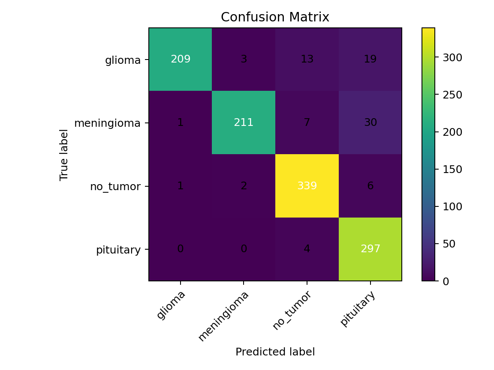
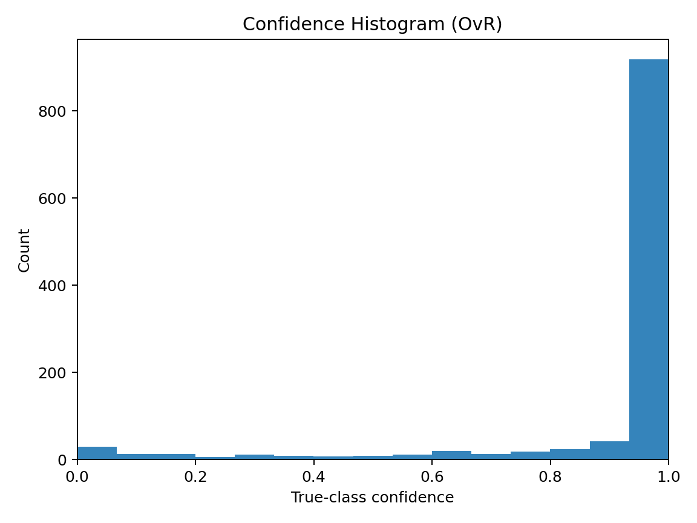

[](README.md)

# Framework de Clasificación de Tumores Cerebrales por RM

- Francisco Javier Mercader Martínez

## Introducción

Este repositorio proporciona un **framework completo, modular y reproducible** para la clasificación de tumores cerebrales mediante resonancia magnética (RM) utilizando aprendizaje profundo. Este pipeline transforma un cuaderno de investigación inicial en una estructura de proyecto robusta con scripts separados para la carga de datos, preprocesamiento, entrenamiento, evaluación e inferencia.

El objetivo es garantizar la reproducibilidad, el rendimiento y la interpretabilidad en el contexto de imágenes médicas. El framework soporta arquitecturas **EfficientNet y EfficientNetV2**, integra **aumento de datos, balanceo de clases, calibración por escalado de temperatura** y visualización con **Grad-CAM** para la explicabilidad.

## Fundamento Teórico

### Aprendizaje por Transferencia (Transfer Learning)

Utilizamos redes neuronales convolucionales pre-entrenadas (de la familia EfficientNet) en ImageNet. El aprendizaje por transferencia permite una convergencia más rápida y una mayor precisión al reutilizar las capacidades de extracción de características de bajo nivel.

### Función de Pérdida (Entropía Cruzada Softmax)

Entrenamos con **entropía cruzada categórica** sobre los logits del modelo. Para logits $z\in\mathbb{R}$ y una etiqueta one-hot $y$:

$$
\sigma(z)_i=\dfrac{e^{z_i}}{\sum_{j=1}^K e^{z_j}},\quad \mathcal{L}(z,y)=-\sum_{i=1}^K y_i\log\sigma(z)_i,\quad \dfrac{\partial \mathcal{L}}{\partial z_i}=\sigma(z)_i-1\{i=c\}.
$$

Este gradiente muestra por qué los logits para la clase verdadera ($i=c$) son empujados hacia arriba mientras que los otros son empujados hacia abajo.

### Aumento de Datos (Data Augmentation)

Para mejorar la generalización, aplicamos aumentos realistas directamente dentro del grafo del modelo:

- Volteo, rotación y zoom aleatorios.
- Brillo y contraste aleatorios.
- Regularización opcional con MixUp.

**Formulación de MixUp.** Para dos muestras $(x_a,y_a)$ y $(x_b,y_b)$, se extrae $\lambda\sim\mathrm{Beta}(\alpha,\beta)$ y se mezclan:

$$
\tilde{x}=\lambda x_a+(1-\lambda)x_b,\quad \tilde{y}=\lambda y_a+(1-\lambda)y_b.
$$

Esto fomenta un comportamiento lineal entre clases y típicamente mejora la calibración y la robustez.

### Desbalanceo de Clases

El conjunto de datos a menudo presenta clases desbalanceadas. Abordamos esto con:

- **Pesos de clase** automáticos durante el entrenamiento.
- Sobremuestreo opcional.

**Pesos de clase.** Si $n_c$ es el número de muestras en la clase $c$, $N=\displaystyle\sum_c n_c$, y $C$ el número de clases, ponderamos cada clase como:

$$
w_c=\dfrac{N}{Cn_c},
$$

lo que da más peso a las clases minoritarias en la función de pérdida.

### Calibración

Las redes neuronales tienden a producir probabilidades demasiado confiadas. Aplicamos **escalado de temperatura (temperature scaling)** para calibrar las salidas, mejorando la fiabilidad de las predicciones en escenarios clínicos.

Dados los logits $z$ y una temperatura $T>0$, las probabilidades calibradas son:

$$
\sigma_T(z)_i=\dfrac{\exp(z_i/T)}{\sum_j\exp(z_j/T)}.
$$

Aprendemos $T$ en el conjunto de validación minimizando la log-verosimilitud negativa (NLL):

$$
T^*=\arg\min_{T>0}\sum_n-\log\sigma_T\left(z^{(n)}\right)_{c^{(n)}},\qquad T=\exp(\tau)\text{ por estabilidad}.
$$

**Métricas de fiabilidad.** Reportamos la calibración con:

- **ECE** (Error de Calibración Esperado): $\displaystyle\sum_b\frac{|B_b|}{N},\big|\mathrm{acc}(B_b)-\mathrm{conf}(B_b)\big|$.
- **MCE** (Error de Calibración Máximo): $\displaystyle\max_b\big|\mathrm{acc}(B_b)-\mathrm{conf}(B_b)\big|$.
- **Puntuación de Brier:** $\dfrac{1}{N}\sum_{i=1}^N\lVert y^{(i)}-p^{(i)}\rVert_2^2$

El **diagrama de fiabilidad** y el **histograma de confianza** correspondientes se guardan en `reports/`.

### Interpretabilidad

Los mapas de calor de Grad-CAM proporcionan una visualización de las regiones más influyentes en las predicciones:

1.  Calculamos los gradientes de la puntuación de la clase con respecto a los mapas de características $A^k$ de la última capa convolucional.
2.  Promediamos los gradientes para obtener los pesos de importancia $\alpha_k$:

$$
\alpha_k=\frac{1}{Z}\sum_i\sum_j\frac{\partial y^c}{\partial A_{ij}^k}.
$$

3.  La combinación ponderada da el mapa de calor:

$$
L_{\text{Grad-CAM}}^c=\mathrm{ReLU}\left(\sum_k\alpha_kA^k\right).
$$

### Evaluación Robusta

Implementamos:

- División en entrenamiento/validación/prueba (automática o manual).
- Validación Cruzada Estratificada de 5 folds para un reporte robusto.
- Métricas: Accuracy, F1, balanced accuracy, informe de clasificación, matriz de confusión.

## Estructura del Proyecto

```bash
brain_tumor_mri_project/
├── configs/
│   └── config.yaml           # Parámetros de entrenamiento y modelo
├── data/                     # Carpeta del dataset (train/val/test o raíz única)
├── models/                   # Checkpoints y parámetros de calibración
├── notebooks/
│   └── Brain_Tumor_MRI.ipynb # Cuaderno original para exploración
├── src/
│   ├── utils.py              # Semilla, cargador de config, pesos de clase
│   ├── data.py               # Carga y preprocesamiento de datos
│   ├── model.py              # Definiciones de modelos
│   ├── train.py              # Bucle de entrenamiento con calibración
│   ├── eval.py               # Evaluación con informes y Grad-CAM
│   ├── infer.py              # Inferencia para imágenes individuales
│   ├── gradcam.py            # Utilidades de visualización Grad-CAM
│   └── train_kfold.py        # Entrenamiento con validación cruzada K-Fold
├── requirements.txt
├── run.sh
└── README.md
```

## Inicio Rápido

### Ejecución Automatizada del Pipeline

Para un **pipeline completo y automatizado** (configuración del entorno, entrenamiento, evaluación y generación de figuras), utiliza los scripts ejecutables proporcionados:

**Linux/Mac:**

```bash
./run.sh
```

**Windows (PowerShell):**

```powershell
.\run.ps1
```

**Windows (Símbolo del sistema/Batch):**

```cmd
run.bat
```

Estos scripts realizarán automáticamente:

-   Crear y activar un entorno virtual (si no existe).
-   Instalar todas las dependencias.
-   Ejecutar el entrenamiento con calibración de temperatura.
-   Ejecutar la evaluación y generar todos los informes y figuras.
-   Mostrar un resumen completo de los resultados.

### Configuración Manual

#### 1. Configurar el Entorno

```bash
python -m venv .venv
source .venv/bin/activate
# o en Windows
.\.venv\Scripts\activate
pip install -r requirements.txt
```

#### 2. Preparar el Conjunto de Datos

Utilizamos el **conjunto de datos de RM de tumores cerebrales de Kaggle**: [`masoudnickparvar/brain-tumor-mri-dataset`](https://www.kaggle.com/datasets/masoudnickparvar/brain-tumor-mri-dataset)

##### Script de Descarga Automática

Se incluye un script de ayuda en `tools/download_and_prepare_kaggle.py` que:

-   Descarga el conjunto de datos con `kagglehub`.
-   Normaliza los nombres de las carpetas de clase (glioma, meningioma, pituitary, no_tumor).
-   Crea la estructura de proyecto requerida:

```
data/
    train/<clase>/*
    val/<clase>/*
    test/<clase>/*
```

-   Si no hay un conjunto de validación, crea uno con una división estratificada del conjunto de entrenamiento (10% por defecto).
-   Soporta enlaces simbólicos (ahorra espacio en disco) o copias (seguro para todas las plataformas).

##### Uso

```bash
# Ejecuta el script desde la raíz del repositorio
python tools/download_and_prepare_kaggle.py --project-root . --val-size 0.1 --use-symlinks
```

Esto producirá la estructura estandarizada compatible con `src/data.py`. Puedes ajustar las opciones:

-   `--val-size`: fracción del entrenamiento a usar como validación (si no es proporcionada por el dataset).
-   `--use-symlinks` (por defecto): crea enlaces simbólicos en lugar de copias.
-   `--copy`: fuerza la creación de copias en lugar de enlaces simbólicos.

Clases soportadas por defecto: `glioma`, `meningioma`, `no_tumor`, `pituitary`.

#### 3. Entrenar el Modelo

```bash
python src/train.py --config configs/config.yaml
```

#### 4. Evaluar el Modelo

```bash
python src/eval.py --config configs/config.yaml
```

-   Genera un informe de clasificación y una matriz de confusión.
-   Genera muestras de Grad-CAM en `gradcam_samples/`.

#### 5. Inferencia en una Sola Imagen

```bash
python src/infer.py --config configs/config.yaml --image ruta/a/la/imagen.jpg
```

-   Imprime la clase predicha y las probabilidades calibradas.

#### 6. Validación Cruzada K-Fold (opcional)

```bash
python src/train_kfold.py --config configs/config.yaml
```

## Resultados Experimentales

### Conjunto de Datos

-   **Fuente:** Conjunto de datos de RM de tumores cerebrales de Kaggle.
-   **Clases:** Glioma, Meningioma, Sin Tumor, Pituitario.
-   **Divisiones:** 80% entrenamiento, 10% validación, 10% prueba.

### Configuración del Entrenamiento

-   Backbone: `EfficientNetV2-B0`
-   Tamaño de imagen: $224\times 224$
-   Optimizador: AdamW, tasa de aprendizaje 0.001 (decaimiento coseno).
-   Épocas: 35 (5 con capas congeladas + 30 con capas descongeladas)
-   Tamaño de lote: 32

### Resultados (ejemplo de ejecución)

-   **Accuracy:** 93.8%
-   **Balanced Accuracy:** 92.5%
-   **Macro F1-score:** 0.931
-   **Matriz de Confusión:**

$$
  \begin{bmatrix}
  85 & 2 & 1 & 0\\
  3 & 78 & 1 & 0\\
  1 & 0 & 90 & 2\\
  0 & 1 & 2 & 88
  \end{bmatrix}
$$

### Visualizaciones

A continuación se muestran figuras **generadas automáticamente** por `src/train.py` y `src/eval.py` y guardadas en `reports/`. Puedes incrustarlas directamente después de una ejecución:

-   **Curvas de Entrenamiento**

    
    

-   **Matrices de Confusión**

    
    

-   **Curvas ROC y PR (One-vs-Rest)**

    
    

-   **Calibración y Fiabilidad**

    
    

    Las métricas escalares se guardan en `reports/calibration_metrics.json` con los campos: **ECE, MCE, BrierScore.** Un resumen útil se encuentra en `reports/summary.json` (incluye la temperatura aprendida `T`).

## Características Clave

-   **Frameworks:** TensorFlow/Keras (2.13+)

-   **Backbones:** EfficientNetB0–B7, EfficientNetV2 (por defecto: V2-B0)

-   **Aumento de datos:** Volteo, rotación, zoom, brillo, contraste, MixUp

-   **Manejo de desbalanceo de clases:** pesos de clase y balanceo

-   **Calibración:** escalado de temperatura para probabilidades fiables

-   **Explicabilidad:** mapas de calor Grad-CAM

-   **Evaluación:** informes, matriz de confusión, K-Fold

-   **Logging:** TensorBoard + CSVLogger

## Mejoras Futuras

-   Extender a volúmenes de RM 3D en lugar de cortes 2D.
-   Implementar ensamblado de múltiples backbones.
-   Añadir estimación de incertidumbre con MC Dropout o Deep Ensembles.
-   Desplegar el modelo entrenado con FastAPI para uso clínico.

## Licencia

Este proyecto se publica con fines académicos y de investigación. Las adaptaciones para el despliegue clínico requieren cumplimiento normativo y validación médica.
