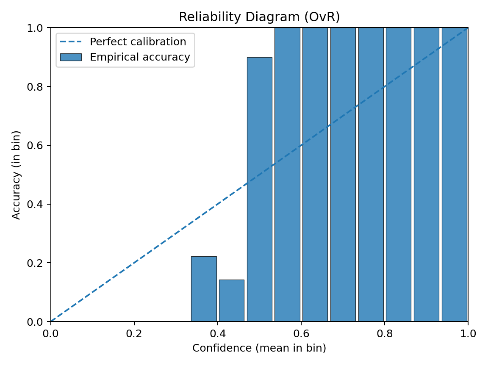

[](README.es.md)

# Brain Tumor MRI Classification Framework

- Francisco Javier Mercader Martínez

## Introduction

This repository provides a **complete, modular, and reproducible framework** for brain tumor MRI classification using deep learning. This pipeline transforms an initial research notebook into a robust project structure with separated scripts for data loading, preprocessing, training, evaluation, and inference.

The goal is to ensure reproducibility, performance, and interpretability in the medical imaging context. The framework supports **EfficientNet and EfficientNetV2 backbones**, integrates **data augmentation, class balancing, temperature scaling calibration**, and **Grad-CAM visualization** for explainability.

## Requirements

### System Requirements

- **Python:** 3.10 or higher
- **OS:** Linux, macOS, or Windows
- **GPU:** NVIDIA GPU with CUDA support (recommended for training)
- **RAM:** 8GB minimum, 16GB recommended
- **Disk Space:** ~5GB for datasets and models

### Kaggle API Configuration

The dataset download scripts require Kaggle API credentials:

1. Create a Kaggle account at [kaggle.com](https://www.kaggle.com)
2. Go to Account Settings → API → Create New Token
3. Place the downloaded `kaggle.json` in:
   - **Linux/macOS:** `~/.kaggle/kaggle.json`
   - **Windows:** `C:\Users\<username>\.kaggle\kaggle.json`
4. Set permissions (Linux/macOS only):
   ```bash
   chmod 600 ~/.kaggle/kaggle.json
   ```

## Theoretical Background

### Transfer Learning & Backbones

We leverage pre-trained convolutional neural networks (EfficientNet family) trained on ImageNet. Transfer learning allows faster convergence and higher accuracy by reusing low-level feature extraction capabilities.

### Loss Function (Softmax Cross-Entropy)

We train with **categorical cross-entropy** on the model logits. For logits $z\in\mathbb{R}$ and one-hot label $y$:

$$
\sigma(z)_i=\dfrac{e^{z_i}}{\sum_{j=1}^K e^{z_j}},\quad \mathcal{L}(z,y)=-\sum_{i=1}^K y_i\log\sigma(z)_i,\quad \dfrac{\partial \mathcal{L}}{\partial z_i}=\sigma(z)_i-1\{i=c\}.
$$

This gradient shows why logits for the true class ($i=c$) are pushed up while others are pushed down.

### Data Augmentation

To improve generalization, we apply realistic augmentations directly inside the model graph:

- Random flip, rotation, zoom.
- Random brightness and contrast.
- Optional MixUp regularization.

**MixUp formulation.** For two samples $(x_a,y_a)$ and $(x_b,y_b)$, draw $\lambda\sim\mathrm{Beta}(\alpha,\beta)$ and mix:

$$
\tilde{x}=\lambda x_a+(1-\lambda)x_b,\quad \tilde{y}=\lambda y_a+(1-\lambda)y_b.
$$

This encourages linear behaviour between classes and typically improves calibration and robustness.

### Class Imbalance

The dataset often presents imbalance classes. We address this with:

- Automatic **class weights** during training.
- Optional oversampling.

**Class weights.** If $n_c$ is the number of samples in class $c$, $N=\displaystyle\sum_c n_c$, and $C$ the number of classes, we weight each class as

$$
w_c=\dfrac{N}{Cn_c},
$$

which up-weights minority classes in the loss.

### Domain Adaptation & Robustness

Medical models often suffer from performance degradation when applied to data from different hospitals or scanners (domain shift). To address this, we implemented a **Fine-Tuning protocol with Custom Hybrid Loss**.

When adapting to an external binary dataset (Tumor/No Tumor) without losing multi-class capabilities, we optimize:

1. **Preservation:** Keep the learned features for Glioma/Meningioma/Pituitary.
2. **Sensitivity:** Penalize the `no_tumor` logit heavily when an external source indicates "Abnormality", regardless of the specific tumor type.

### Calibration

Neural networks tend to output overconfident probabilities. We apply **temperature scaling** to calibrate outputs, improving the reliability of predictions in clinical scenarios.

Given logits $z$ and temperature $T>0$, calibrated probabilities are

$$
\sigma_T(z)_i=\dfrac{\exp(z_i/T)}{\sum_j\exp(z_j/T)}.
$$

We learn $T$ on the validation set by minimizing the negative log-likelihood (NLL):

$$
T^*=\arg\min_{T>0}\sum_n-\log\sigma_T\left(z^{(n)}\right)_{c^{(n)}},\qquad T=\exp(\tau)\text{ for stability}.
$$

**Reliability metrics.** We report calibration with:

- **ECE** (Expected Calibration Error): $\displaystyle\sum_b\frac{|B_b|}{N},\big|\mathrm{acc}(B_b)-\mathrm{conf}(B_b)\big|$.
- **MCE** (Maximum Calibration Error): $\displaystyle\max_b\big|\mathrm{acc}(B_b)-\mathrm{conf}(B_b)\big|$.
- **Brier score:** $\dfrac{1}{N}\sum_{i=1}^N\lVert y^{(i)}-p^{(i)}\rVert_2^2$

Corresponding **reliability diagram** and **confidence histogram** are saved to `reports/`.

### Interpretability

Grad-CAM heatmaps provide a visualization of salient regions influencing predictions:

1. Compute gradients of class score w.r.t. feature maps $A^k$ of the last conv layer.
2. Average gradients to obtain importance weights $\alpha_k$:

$$
\alpha_k=\frac{1}{Z}\sum_i\sum_j\frac{\partial y^c}{\partial A_{ij}^k}.
$$

4. Weighted combination gives the heatmap:

$$
L_{\text{Grad-CAM}}^c=\mathrm{ReLU}\left(\sum_k\alpha_kA^k\right).
$$

**Usage:** Grad-CAM visualizations are automatically generated during evaluation and saved to `reports/gradcam/`. You can also generate them during inference:

```bash
python src/infer.py --config configs/config.yaml --image path/to/scan.jpg --gradcam
```

### Robust Evaluation

We implement:

- Train/validation/test split (auto or manual).
- Stratified 5-fold Cross-Validation for robust reporting.
- Metrics: Accuracy, F1, balanced accuracy, classification report, confusion matrix.

## Project Structure

```bash
Brain_Tumor_MRI/
├── configs/
│   └── config.yaml               # Training and model parameters
├── data/                         # Dataset folder
│   ├── train/<class>/*           # Training images
│   ├── val/<class>/*             # Validation images
│   ├── test/<class>/*            # Test images
│   └── external_navoneel/        # External validation dataset
├── models/                       # Checkpoints
│   ├── best.keras                # Best base model
│   └── finetuned_navoneel.keras  # Fine-tuned model
├── reports/                      # Generated figures and metrics
│   ├── acc_curve.png             # Training accuracy curve
│   ├── loss_curve.png            # Training loss curve
│   ├── cm.png                    # Confusion matrix
│   ├── cm_norm.png               # Normalized confusion matrix
│   ├── roc_curves.png            # ROC curves (One-vs-Rest)
│   ├── pr_curves.png             # Precision-Recall curves
│   ├── reliability_diagram.png  # Calibration reliability diagram
│   ├── confidence_hist.png       # Confidence histogram
│   ├── calibration_metrics.json  # ECE, MCE, Brier Score
│   ├── classification_report.txt # Per-class metrics
│   ├── training_history.json     # Training metrics per epoch
│   └── summary.json              # Model summary with temperature
├── tools/                        # Utility scripts
│   ├── download_and_prepare_kaggle.py  # Main dataset downloader
│   ├── download_navoneel.py            # External validation dataset
│   ├── train_finetune.py               # Domain adaptation training
│   ├── evaluate_external.py            # External testing logic
│   └── optimize_threshold.py           # Sensitivity/Specificity tuning
├── src/                          # Core modules
│   ├── utils.py                  # Configuration and utilities
│   ├── data.py                   # Dataset loading and augmentation
│   ├── model.py                  # Model architecture
│   ├── train.py                  # Training loop
│   ├── train_kfold.py            # K-Fold cross-validation training
│   ├── eval.py                   # Evaluation and metrics
│   ├── infer.py                  # Single image inference
│   ├── gradcam.py                # Grad-CAM visualization utilities
│   └── plots.py                  # Plotting utilities
├── run.sh                        # Pipeline script (Linux/macOS)
├── run.bat                       # Pipeline script (Windows CMD)
├── run.ps1                       # Pipeline script (Windows PowerShell)
├── requirements.txt              # Python dependencies
└── README.md
```

## Quickstart

### Automated Pipeline Execution

For a **complete automated pipeline** (environment setup, training, evaluation, and figure generation), use the provided executable scripts:

**Linux/Mac:**

```bash
./run.sh
```

**Windows (PowerShell):**

```powershell
.\run.ps1
```

**Windows (Command Prompt/Batch):**

```cmd
run.bat
```

**What does this script do?**

1. Sets up the Python environment.
2. Downloads the main dataset ([MasoudNickparvar](https://www.kaggle.com/datasets/masoudnickparvar/brain-tumor-mri-dataset))
3. **Trains** the base multi-class model.
4. **Evaluates** the base model on its test set.
5. Downloads an **External Dataset** ([Navoneel](https://www.kaggle.com/datasets/navoneel/brain-mri-images-for-brain-tumor-detection)) to test generalization.
6. Performs **Fine-Tuning** using the external dataset to adapt the model and improve sensitivity.
7. **Evaluates** the fine-tuned model on the external data and calculates the **Optimal Threshold** to balance False Positives/Negatives.

### External Validation & Robustness Results

To test the model's reliability in a real-world scenario, we evaluated it against the **Navoneel Dataset** (unseen during initial training).

1. The Generalization Gap

    Initially, the base model showed high specificity (0 False Positives) but low sensitivity on the new data, missing $\sim30\%$ of tumors. This is a common "conservative" behaviour in medical AI when facing domain shifts.

2. Fine-Tuning & Optimization

    We applied a **binary-masked fine-tuning** process and **threshold optimization**.

| **Metric**               | **Base Model** | **Optimized Model (Threshold 0.65)** |
| ------------------------ | -------------- | ------------------------------------ |
| **Accuracy**             | 85%            | **84%**                              |
| **Recall (Sensitivity)** | 70%            | **91%**                              |
| **False Negatives**      | 26 (High Risk) | **8 (Low Risk)**                     |
| **False Positives**      | 0              | **20**                               |

**Clinical Implication:** The optimized pipeline successfully transformed the model from a "conservative" classifier into a **highly sensitive screening tool**, capable of detecting anomalies even in data distributions it hasn't explicitly seen before, prioritizing patient safety (minimizing missed tumors).

### Manual Setup

### 1. Setup Environment

```bash
python -m venv .venv
source .venv/bin/activate
# or Windows
.\.venv\Scripts\activate
pip install -r requirements.txt
```

### 2. Prepare Dataset

We use the **Kaggle Brain Tumor MRI dataset**: [`masoudnickparvar/brain-tumor-mri-dataset`](https://www.kaggle.com/datasets/masoudnickparvar/brain-tumor-mri-dataset)

#### Automatic Download Script

A helper script is included at `tools/download_and_prepare_kaggle.py` which:

- Downloads the dataset with `kagglehub`.
- Normalizes class folder names (glioma, meningioma, pituitary, no_tumor).
- Creates the required project layout:

```
data/
    train/<class>/*
    val/<class>/*
    test/<class>/*
```

- If no validation set is present, create one with a stratified split from train (default 10%).
- Supports symlinks (saves disk space) or copies (safe for all platforms).

#### Usage

```bash
# Run the script from repo root
python tools/download_and_prepare_kaggle.py --project-root . --val-size 0.1 --use-symlinks
```

This will produce the standarized layout compatible with `src/data.py`. You can adjust options:

- `--val-size` fraction of training to use as validation (if not provided by dataset).
- `--use-symlinks` (default) create symlinks instead of copies.
- `--copy` forces copies instead of symlinks.

Classes supported by default: `glioma`, `meningioma`, `no_tumor`, `pituitary`.

### 1. Train Base Model

```bash
python src/train.py --config configs/config.yaml
```

### 2. K-Fold Cross-Validation (Optional)

For more robust performance estimation with confidence intervals:

```bash
python src/train_kfold.py --config configs/config.yaml --folds 5
```

This generates per-fold metrics and reports mean ± std accuracy across all folds.

### 3. Fine-Tune on External Data

```bash
# Download external data
python tools/download_navoneel.py
# Run adaptation training
python tools/train_finetune.py --config configs/config.yaml --data data/external_navoneel
```

### 4. Inference with Clinical Threshold

Use the optimized threshold (found by `tools/optimize_threshold.py`, typically $\sim0.65$) for inference:

```bash
# Basic inference
python src/infer.py --config configs/config.yaml --image path/to/scan.jpg --threshold 0.65

# With Grad-CAM visualization
python src/infer.py --config configs/config.yaml --image path/to/scan.jpg --threshold 0.65 --gradcam
```

### Visualizations

Below are figures **automatically generated** by `src/train.py` and `src/eval.py` and saved into `reports/`. You can embed them directly after a run:

- **Training Curves**

  
  

- **Confusion Matrices**

  
  

- **ROC & PR Curves (One-vs-Rest)**

  
  

- **Calibration & Reliability**

  
  

  Scalar metrics metrics are saved to `reports/calibration_metrics.json` with fields: **ECE, MCE, BrierScore.** A handy summary is in `reports/summary.json` (includes the learned temperature `T`).

## Key Features

- **Frameworks:** TensorFlow/Keras (2.13+)
- **Backbones:** EfficientNetB0–B7, EfficientNetV2 (default: V2-B0)
- **Augmentation:** Flip, rotate, zoom, brightness, contrast, MixUp
- **Class imbalance handling:** Class weights & balancing
- **Calibration:** Temperature scaling for reliable probabilities
- **Explainability:** Grad-CAM heatmaps
- **Evaluation:** Reports, confusion matrix, K-Fold cross-validation
- **Logging:** TensorBoard + CSVLogger
- **Cross-platform:** Scripts for Linux, macOS, and Windows

## Troubleshooting

### Common Issues

1. **`ModuleNotFoundError: No module named 'src'`**
   
   Ensure you run scripts from the project root or set PYTHONPATH:
   ```bash
   export PYTHONPATH=/path/to/Brain_Tumor_MRI:$PYTHONPATH
   ```

2. **Kaggle API errors**
   
   Verify your `kaggle.json` is correctly placed and has proper permissions.

3. **GPU not detected**
   
   Check CUDA installation and TensorFlow GPU compatibility:
   ```bash
   python -c "import tensorflow as tf; print(tf.config.list_physical_devices('GPU'))"
   ```

4. **Out of Memory (OOM)**
   
   Reduce batch size in `configs/config.yaml`:
   ```yaml
   train:
     batch_size: 8  # Reduce from 16 or 32
   ```

## Future Improvements

- Extend to 3D MRI volumes instead of 2D slices.
- Add uncertainty estimation with MC Dropout or Deep Ensembles.
- Deploy trained model with FastAPI for clinical usage.

## License

This project is released for academic and research purpose. Adaptations for clinical deployment require regulatory compliance and medical validation.
