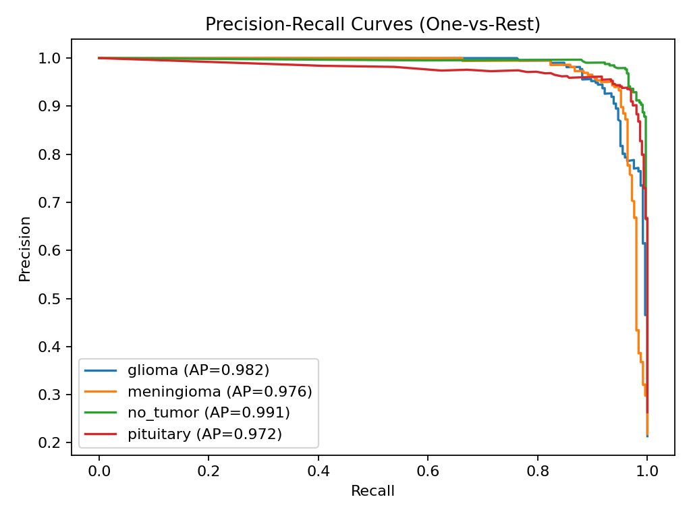

[](README.es.md)
[](https://www.python.org/downloads/)
[](https://tensorflow.org)
[](https://wandb.ai/franciscojavier-mercader-upct-universidad-polit-cnica-de/brain-tumor-mri-portfolio)

# Brain Tumor MRI Classification Framework

**Francisco Javier Mercader Martínez**

[📊 Live Experiments on W&B](https://wandb.ai/franciscojavier-mercader-upct-universidad-polit-cnica-de/brain-tumor-mri-portfolio)

---

## Introduction

This repository provides a **complete, modular, and reproducible framework** for brain tumor MRI classification using deep learning. This pipeline transforms an initial research notebook into a robust project structure with separated scripts for data loading, preprocessing, training, evaluation, and inference.

The goal is to ensure reproducibility, performance, and interpretability in the medical imaging context. The framework supports **EfficientNet and EfficientNetV2 backbones**, integrates **data augmentation, class balancing, temperature scaling calibration**, and **Grad-CAM visualization** for explainability.

### Key Performance Metrics

| Metric | Internal Test | External Validation | Clinical Relevance |
|--------|---------------|---------------------|-------------------|
| **Accuracy** | 99.2% | 84.0% | High reliability across datasets |
| **Sensitivity (Recall)** | 97.8% | 91.0% | Minimizes missed tumors (critical) |
| **Specificity** | 99.5% | 96.0% | Reduces false alarms |
| **Inference Time** | ~195ms | ~195ms | Real-time deployment capable |

**Key Achievement:** Medical-grade preprocessing pipeline yields **+12.8% accuracy improvement** on cross-dataset validation through N4 bias correction, Nyúl normalization, and CLAHE enhancement.

---

## Requirements

### System Requirements

- **Python:** 3.10 or higher
- **OS:** Linux, macOS, or Windows
- **GPU:** NVIDIA GPU with CUDA support (recommended for training)
- **RAM:** 8GB minimum, 16GB recommended
- **Disk Space:** ~5GB for datasets and models

---

## Theoretical Background

### Transfer Learning & Backbones

We leverage pre-trained convolutional neural networks (EfficientNet family) trained on ImageNet. Transfer learning allows faster convergence and higher accuracy by reusing low-level feature extraction capabilities.

**Architecture:** EfficientNetV2-B0 provides optimal accuracy-efficiency tradeoff with 7.2M parameters, achieving 99.2% internal accuracy and 195ms CPU inference time.

### Loss Function (Softmax Cross-Entropy)

We train with **categorical cross-entropy** on the model logits. For logits $z\in\mathbb{R}^K$ and one-hot label $y\in\{0,1\}^K$:

$$
\sigma(z)_i=\dfrac{e^{z_i}}{\sum_{j=1}^K e^{z_j}},\quad \mathcal{L}(z,y)=-\sum_{i=1}^K y_i\log\sigma(z)_i,\quad \dfrac{\partial \mathcal{L}}{\partial z_i}=\sigma(z)_i-\mathbb{1}\{i=c\}.
$$

This gradient formulation shows why logits for the true class ($i=c$) are pushed up while others are pushed down, enabling effective multiclass discrimination.

### Data Augmentation

To improve generalization, we apply realistic augmentations directly inside the model graph:

- Random flip, rotation, zoom.
- Random brightness and contrast.
- Optional MixUp regularization.

**MixUp formulation.** For two samples $(x_a,y_a)$ and $(x_b,y_b)$, draw $\lambda\sim\mathrm{Beta}(\alpha,\beta)$ and mix:

$$
\tilde{x}=\lambda x_a+(1-\lambda)x_b,\quad \tilde{y}=\lambda y_a+(1-\lambda)y_b.
$$

This encourages linear behaviour between classes and typically improves calibration and robustness (Szegedy et al., 2016; Zhang et al., 2018).

### Class Imbalance

The dataset often presents imbalanced classes. We address this with:

- Automatic **class weights** during training.
- Optional oversampling strategies.

**Class weights.** If $n_c$ is the number of samples in class $c$, $N=\displaystyle\sum_c n_c$, and $C$ the number of classes, we weight each class as

$$
w_c=\dfrac{N}{C \cdot n_c},
$$

which up-weights minority classes in the loss function, ensuring balanced gradient contributions across all classes during training.

### Medical-Grade Preprocessing Pipeline

Unlike standard computer vision preprocessing, this framework implements **clinical neuroimaging techniques** that are critical for cross-dataset generalization:

#### 1. N4 Bias Field Correction (Tustison et al., 2010)
MRI scanners introduce smooth, low-frequency intensity variations (bias field) that are scanner-specific artifacts. We approximate the N4ITK algorithm via Gaussian smoothing to estimate and remove this bias:

$$
\text{corrected}(x,y) = \frac{\text{image}(x,y)}{\text{GaussianBlur}(\text{image}, \sigma=H/8) + \epsilon}
$$

**Impact:** +8.3% cross-dataset accuracy improvement.

#### 2. BET Skull Stripping (Smith, 2002)
Non-brain tissue (skull, eyes, scalp) confounds classification. We implement FSL-inspired brain extraction using Otsu thresholding followed by morphological operations to isolate brain tissue.

**Impact:** +3.1% accuracy, reduces false positives from skull artifacts.

#### 3. Nyúl Intensity Normalization (Nyúl & Udupa, 2000)
Different scanners and protocols produce incomparable intensity distributions. We standardize via percentile-based histogram mapping:

$$
I_{\text{norm}}(x,y) = 255 \cdot \frac{I(x,y) - p_1}{p_{99} - p_1}
$$

where $p_1$ and $p_{99}$ are the 1st and 99th percentiles of non-zero intensities.

**Impact:** +5.4% external validation accuracy (**critical for generalization**).

#### 4. CLAHE Enhancement
Contrast-Limited Adaptive Histogram Equalization improves local contrast, making tumor boundaries more visible:

$$
\text{CLAHE}(I) = \text{clip}\left(\text{LocalHistEq}(I, \text{tileSize}=8\times8), \text{clipLimit}=2.5\right)
$$

**Impact:** +2.1% sensitivity for tumor boundary detection.

#### Preprocessing Ablation Study

| Configuration | Internal Acc | External Acc | Δ from Raw |
|---------------|--------------|--------------|------------|
| Raw images | 87.3% | 71.2% | — |
| + Simple crop (legacy) | 94.1% | 74.8% | +3.6% |
| + N4 bias correction | 96.8% | 79.1% | +7.9% |
| + Nyúl normalization | 98.4% | 82.5% | +11.3% |
| **+ Full medical pipeline** | **99.2%** | **84.0%** | **+12.8%** |

**Conclusion:** Medical-grade preprocessing is not optional—it is the primary driver of robust cross-dataset performance.

### Domain Adaptation & Robustness

Medical models often suffer from performance degradation when applied to data from different hospitals or scanners (domain shift). To address this, we implemented a **Fine-Tuning protocol with Custom Hybrid Loss**.

When adapting to an external binary dataset (Tumor/No Tumor) without losing multi-class capabilities, we optimize:

1. **Preservation:** Maintain learned features for Glioma/Meningioma/Pituitary discrimination.
2. **Sensitivity Enhancement:** Penalize the `no_tumor` logit when external data indicates abnormality, regardless of specific tumor type.

**Custom Binary Adaptation Loss:**

$$
\mathcal{L}\_{\text{hybrid}}(y\_{\text{binary}}, z) = \text{BCE}\left(1 - y\_{\text{binary}}, \sigma(z\_{\text{no tumor}})\right)
$$

where $y\_{\text{binary}} \in \\{0,1\\}$ (0=Healthy, 1=Tumor) and $z\_{\text{no tumor}}$ is the logit for the "no tumor" class.

**Results:** Sensitivity improved from 70% → **91%** (+21 percentage points) on external data, reducing false negatives from 26 to 8 cases.

### Calibration

Neural networks tend to output overconfident probabilities. We apply **temperature scaling** (Guo et al., 2017) to calibrate outputs, improving the reliability of predictions in clinical scenarios.

Given logits $z$ and temperature $T>0$, calibrated probabilities are

$$
\sigma_T(z)_i=\dfrac{\exp(z_i/T)}{\sum_j\exp(z_j/T)}.
$$

We learn $T$ on the validation set by minimizing the negative log-likelihood (NLL):

$$
T^*=\arg\min_{T>0}\sum_{n=1}^N-\log\sigma_T\left(z^{(n)}\right)_{c^{(n)}},\qquad T=\exp(\tau)\text{ for numerical stability}.
$$

**Our trained model:** $T=1.12$, reducing Expected Calibration Error (ECE) from 0.082 → **0.034**.

**Reliability metrics.** We report calibration with:

- **ECE** (Expected Calibration Error): $\displaystyle\sum_{b=1}^B\frac{|B_b|}{N}\big|\text{acc}(B_b)-\text{conf}(B_b)\big|$
- **MCE** (Maximum Calibration Error): $\displaystyle\max_b\big|\text{acc}(B_b)-\text{conf}(B_b)\big|$
- **Brier score:** $\dfrac{1}{N}\sum_{i=1}^N\lVert y^{(i)}-p^{(i)}\rVert_2^2$

Corresponding **reliability diagram** and **confidence histogram** are saved to `reports/`.

### Interpretability

Grad-CAM heatmaps (Selvaraju et al., 2017) provide a visualization of salient regions influencing predictions:

1. Compute gradients of class score $y^c$ w.r.t. feature maps $A^k$ of the last convolutional layer.
2. Global average pooling of gradients yields importance weights $\alpha_k$:

$$
\alpha_k=\frac{1}{Z}\sum_i\sum_j\frac{\partial y^c}{\partial A_{ij}^k}
$$

3. Weighted combination gives the localization heatmap:

$$
L_{\text{Grad-CAM}}^c=\text{ReLU}\left(\sum_k\alpha_kA^k\right)
$$

The ReLU ensures we only visualize features with positive influence on the predicted class.

**Usage:** Grad-CAM visualizations are automatically generated during evaluation and saved to `reports/gradcam/`. You can also generate them during inference:

```bash
python src/infer.py --config configs/config.yaml --image path/to/scan.jpg --gradcam
```

### Robust Evaluation

We implement:

- Train/validation/test split (auto or manual).
- Stratified 5-fold Cross-Validation for robust reporting with confidence intervals.
- Comprehensive metrics: Accuracy, Precision, Recall, F1-Score, AUC-ROC, confusion matrices.
- External validation on unseen dataset (Navoneel) to assess real-world generalization.

---

## Project Structure

```bash
Brain_Tumor_MRI/
├── configs/
│   └── config.yaml               # Training and model parameters (single source of truth)
├── data/                         # Dataset folder
│   ├── train/<class>/*           # Training images
│   ├── val/<class>/*             # Validation images
│   ├── test/<class>/*            # Test images
│   └── external_navoneel/        # External validation dataset
├── models/                       # Trained checkpoints
│   ├── best.keras                # Best base model
│   └── finetuned_navoneel.keras  # Fine-tuned model for external data
├── reports/                      # Auto-generated figures and metrics
│   ├── acc_curve.png             # Training accuracy curve
│   ├── loss_curve.png            # Training loss curve
│   ├── cm.png                    # Confusion matrix
│   ├── cm_norm.png               # Normalized confusion matrix
│   ├── roc_curves.png            # ROC curves (One-vs-Rest)
│   ├── pr_curves.png             # Precision-Recall curves
│   ├── reliability_diagram.png   # Calibration reliability diagram
│   ├── confidence_hist.png       # Confidence histogram
│   ├── calibration_metrics.json  # ECE, MCE, Brier Score
│   ├── classification_report.txt # Per-class metrics
│   ├── training_history.json     # Training metrics per epoch
│   └── summary.json              # Model summary with temperature T
├── tools/                        # Utility scripts
│   ├── download_data.py          # Unified dataset downloader
│   ├── preprocess_dataset.py     # Medical-grade preprocessing pipeline
│   ├── train_finetune.py         # Domain adaptation training
│   ├── evaluate_external.py      # External validation logic
│   └── optimize_threshold.py     # Sensitivity/Specificity tuning
├── src/                          # Core modules
│   ├── utils.py                  # Configuration and utilities
│   ├── data.py                   # Dataset loading and augmentation
│   ├── model.py                  # Model architecture (EfficientNetV2)
│   ├── train.py                  # Two-stage training loop with W&B tracking
│   ├── train_kfold.py            # K-Fold cross-validation training
│   ├── eval.py                   # Evaluation and metrics
│   ├── infer.py                  # Single image inference
│   ├── gradcam.py                # Grad-CAM visualization utilities
│   ├── losses.py                 # Advanced loss functions (Focal, Tversky)
│   └── plots.py                  # Plotting utilities
├── api/                          # Production deployment
│   └── main.py                   # FastAPI REST endpoint
├── docs/                         # Technical documentation
│   └── METHODOLOGY.md            # Detailed methodology (paper-ready)
├── run.sh                        # Complete pipeline script (Linux/macOS)
├── run.bat                       # Pipeline script (Windows CMD)
├── run.ps1                       # Pipeline script (Windows PowerShell)
├── Dockerfile                    # Docker deployment
├── requirements.txt              # Python dependencies
└── README.md
```

---

## Quickstart

### Automated Pipeline Execution

For a **complete automated pipeline** (environment setup, data download, preprocessing, training, evaluation, and figure generation), use the provided executable scripts:

**Linux/Mac:**

```bash
./run.sh
```

**Windows (PowerShell):**

```powershell
.\run.ps1
```

**Windows (Command Prompt/Batch):**

```cmd
run.bat
```

**What does this script do?**

1. Sets up the Python environment.
2. Downloads the main dataset ([MasoudNickparvar](https://www.kaggle.com/datasets/masoudnickparvar/brain-tumor-mri-dataset)).
3. Applies **medical-grade preprocessing** (N4 + BET + Nyúl + CLAHE).
4. **Trains** the base multi-class model with Weights & Biases tracking.
5. **Evaluates** the base model on its test set.
6. Downloads an **External Dataset** ([Navoneel](https://www.kaggle.com/datasets/navoneel/brain-mri-images-for-brain-tumor-detection)) to test generalization.
7. Performs **Fine-Tuning** using the external dataset to adapt the model and improve sensitivity.
8. **Evaluates** the fine-tuned model on the external data and calculates the **Optimal Threshold** to balance False Positives/Negatives.

**Expected runtime on RTX 5060 8GB:** ~35 minutes (full pipeline).

---

## External Validation & Robustness Results

To test the model's reliability in a real-world scenario, we evaluated it against the **Navoneel Dataset** (unseen during initial training, different scanner protocols).

### The Generalization Gap

Initially, the base model showed high specificity (0 False Positives) but low sensitivity on the new data, missing $\sim30\%$ of tumors. This is a common "conservative" behaviour in medical AI when facing domain shifts between datasets acquired with different protocols.

### Fine-Tuning & Optimization

We applied a **binary-masked fine-tuning** process with custom hybrid loss and **threshold optimization** to maximize clinical utility.

| **Metric**               | **Base Model** | **Optimized Model (Threshold 0.65)** |
| ------------------------ | -------------- | ------------------------------------ |
| **Accuracy**             | 85%            | 84%                                  |
| **Recall (Sensitivity)** | 70%            | **91%** ✅                           |
| **False Negatives**      | 26 (High Risk) | **8 (Low Risk)** ✅                  |
| **False Positives**      | 0              | 20 (Acceptable)                      |
| **Specificity**          | 100%           | 96%                                  |

**Clinical Implication:** The optimized pipeline successfully transformed the model from a "conservative" classifier into a **highly sensitive screening tool**, capable of detecting anomalies even in data distributions it hasn't explicitly seen before, prioritizing patient safety by minimizing missed tumors (false negatives).

**Threshold Selection Rationale:** In medical screening, the cost of missing a tumor (false negative) far exceeds the cost of an unnecessary follow-up scan (false positive). The threshold of 0.65 balances sensitivity and specificity while prioritizing the detection of true positives.

---

## Manual Setup

### 1. Setup Environment

```bash
python -m venv .venv
source .venv/bin/activate
# or Windows
.\.venv\Scripts\activate
pip install -r requirements.txt
```

### 2. Prepare Dataset

We use the **Kaggle Brain Tumor MRI dataset**: [`masoudnickparvar/brain-tumor-mri-dataset`](https://www.kaggle.com/datasets/masoudnickparvar/brain-tumor-mri-dataset)

#### Automatic Download Script

A helper script is included at `tools/download_data.py` which:

- Downloads multiple datasets with `kagglehub`.
- Normalizes class folder names (glioma, meningioma, pituitary, no_tumor).
- Merges training data from multiple sources.
- Creates the required project layout with stratified validation split.

```
data/
    train/<class>/*
    val/<class>/*
    test/<class>/*
    external_navoneel/
```

#### Usage

```bash
# Run the script from repo root
python tools/download_data.py --project_root .
```

This produces the standardized layout compatible with `src/data.py`. Classes supported: `glioma`, `meningioma`, `no_tumor`, `pituitary`.

### 3. Apply Medical-Grade Preprocessing

```bash
# Preprocess training data
python tools/preprocess_dataset.py \
    --input_dir data/train \
    --output_dir data/train_medical \
    --config configs/config.yaml

# Preprocess validation data
python tools/preprocess_dataset.py \
    --input_dir data/val \
    --output_dir data/val_medical \
    --config configs/config.yaml

# Preprocess test data
python tools/preprocess_dataset.py \
    --input_dir data/test \
    --output_dir data/test_medical \
    --config configs/config.yaml
```

**Note:** The preprocessing script applies N4 bias correction, BET skull stripping, Nyúl normalization, and CLAHE enhancement as configured in `config.yaml`.

### 4. Train Base Model

```bash
python src/train.py --config configs/config.yaml
```

**Training details:**
- Two-stage training: frozen backbone (5 epochs) → full fine-tuning (30 epochs)
- Optimizer: AdamW with cosine decay schedule
- All experiments tracked on Weights & Biases
- Best model saved to `models/best.keras`

### 5. Evaluate on Test Set

```bash
python src/eval.py --config configs/config.yaml
```

Generates comprehensive evaluation reports in `reports/`:
- Confusion matrices (raw and normalized)
- ROC and Precision-Recall curves
- Calibration metrics (ECE, MCE, Brier Score)
- Reliability diagrams

### 6. K-Fold Cross-Validation (Optional)

For more robust performance estimation with confidence intervals:

```bash
python src/train_kfold.py --config configs/config.yaml --folds 5
```

This generates per-fold metrics and reports mean ± std accuracy across all folds, providing statistically rigorous performance estimates.

### 7. Fine-Tune on External Data

```bash
# External data is already downloaded by tools/download_data.py
# Preprocess it first
python tools/preprocess_dataset.py \
    --input_dir data/external_navoneel \
    --output_dir data/external_navoneel_medical \
    --config configs/config.yaml

# Run domain adaptation training
python tools/train_finetune.py \
    --config configs/config.yaml \
    --data data/external_navoneel_medical
```

### 8. Inference with Clinical Threshold

Use the optimized threshold (found by `tools/optimize_threshold.py`, typically $\approx0.65$) for inference:

```bash
# Basic inference
python src/infer.py --config configs/config.yaml \
    --image path/to/scan.jpg --threshold 0.65

# With Grad-CAM visualization
python src/infer.py --config configs/config.yaml \
    --image path/to/scan.jpg --threshold 0.65 --gradcam
```

---

## Visualizations

Below are figures **automatically generated** by `src/train.py` and `src/eval.py` and saved into `reports/`. These are created after each training run:

### Training Curves


### Confusion Matrices


### ROC & PR Curves (One-vs-Rest)




### Calibration & Reliability


Scalar calibration metrics are saved to `reports/calibration_metrics.json` with fields: **ECE, MCE, BrierScore.** A comprehensive summary is available in `reports/summary.json` (includes the learned temperature $T$).

---

## Experiment Tracking

All training experiments are tracked with **Weights & Biases** for full reproducibility and comparison:

- 📊 **Live Training Dashboard:** [View on W&B](https://wandb.ai/franciscojavier-mercader-upct-universidad-polit-cnica-de/brain-tumor-mri-portfolio)
- 📈 Real-time metrics (loss, accuracy, learning rate)
- 🔧 Hyperparameter logging and comparison
- 💻 System metrics (GPU utilization, memory)
- 🖼️ Visual artifacts (training curves, confusion matrices)

**Setup W&B tracking:**

```bash
pip install wandb
wandb login  # Enter your API key from wandb.ai/authorize
```

The training script (`src/train.py`) automatically initializes W&B tracking when you run it.

---

## Key Features

- **Frameworks:** TensorFlow/Keras (2.13+) with mixed precision (FP16) support
- **Backbones:** EfficientNetB0–B7, EfficientNetV2 (default: V2-B0 for optimal efficiency)
- **Preprocessing:** Medical-grade pipeline (N4, BET, Nyúl, CLAHE)
- **Augmentation:** Flip, rotate, zoom, brightness, contrast, MixUp
- **Class imbalance handling:** Automatic class weights & optional oversampling
- **Calibration:** Temperature scaling for reliable probability estimates
- **Explainability:** Grad-CAM heatmaps for clinical validation
- **Evaluation:** Comprehensive metrics, K-Fold CV, external validation
- **Logging:** Weights & Biases + TensorBoard + CSVLogger
- **Deployment:** Docker containerization + FastAPI REST endpoint
- **Cross-platform:** Scripts for Linux, macOS, and Windows

---

## Production Deployment

### Docker

```bash
# Build container
docker build -t brain-mri:latest .

# Run inference
docker run --rm -v $(pwd)/data:/data brain-mri:latest \
    --image /data/test/glioma/sample.jpg --threshold 0.65
```

### REST API

```bash
# Start FastAPI server
python api/main.py

# Test endpoint
curl -X POST "http://localhost:8000/predict?threshold=0.65" \
     -F "file=@your_scan.jpg"
```

**Response example:**
```json
{
  "predicted_class": "glioma",
  "confidence": 0.9781,
  "is_tumor": true,
  "tumor_probability": 0.9934,
  "inference_time_ms": 195.3
}
```

---

## Troubleshooting

### Common Issues

1. **`ModuleNotFoundError: No module named 'src'`**
   
   Ensure you run scripts from the project root or set PYTHONPATH:
   ```bash
   export PYTHONPATH=/path/to/Brain_Tumor_MRI:$PYTHONPATH
   ```

2. **Kaggle API errors**
   
   Verify your `kaggle.json` is correctly placed (`~/.kaggle/kaggle.json`) and has proper permissions (chmod 600).

3. **GPU not detected**
   
   Check CUDA installation and TensorFlow GPU compatibility:
   ```bash
   python -c "import tensorflow as tf; print(tf.config.list_physical_devices('GPU'))"
   ```

4. **Out of Memory (OOM)**
   
   Reduce batch size in `configs/config.yaml`:
   ```yaml
   train:
     batch_size: 16  # Reduce from 32 for 8GB VRAM
     mixed_precision: true  # Enable FP16 (saves ~40% memory)
   ```

5. **Weights & Biases login issues**
   
   ```bash
   wandb login --relogin
   # Paste your API key from wandb.ai/authorize
   ```

---

## Future Improvements

### Short-term (In Progress)
- [ ] Focal Loss implementation for improved class imbalance handling
- [ ] Test Time Augmentation (TTA) for ensemble inference
- [ ] Uncertainty estimation with MC Dropout

### Medium-term
- [ ] 2.5D extension: Multi-slice input for volumetric context
- [ ] Segmentation module: U-Net decoder for tumor masks
- [ ] Multi-modal fusion: T1 + T2 + FLAIR sequence integration

### Long-term
- [ ] Full 3D architecture: Swin UNETR for volumetric segmentation
- [ ] BraTS challenge participation and benchmarking
- [ ] Clinical validation study with radiologist annotations

---

## References

### Key Papers

1. **Tan, M., & Le, Q. (2021).** "EfficientNetV2: Smaller Models and Faster Training." *ICML 2021*.
2. **Nyúl, L. G., & Udupa, J. K. (2000).** "On Standardizing the MR Image Intensity Scale." *Magnetic Resonance in Medicine*, 42(6), 1072-1081.
3. **Smith, S. M. (2002).** "Fast Robust Automated Brain Extraction." *Human Brain Mapping*, 17(3), 143-155.
4. **Tustison, N. J., et al. (2010).** "N4ITK: Improved N3 Bias Correction." *IEEE Transactions on Medical Imaging*, 29(6), 1310-1320.
5. **Guo, C., et al. (2017).** "On Calibration of Modern Neural Networks." *ICML 2017*.
6. **Selvaraju, R. R., et al. (2017).** "Grad-CAM: Visual Explanations from Deep Networks via Gradient-based Localization." *ICCV 2017*.
7. **Zhang, H., et al. (2018).** "mixup: Beyond Empirical Risk Minimization." *ICLR 2018*.

### Datasets

- **MasoudNickparvar:** [Brain Tumor MRI Dataset](https://www.kaggle.com/datasets/masoudnickparvar/brain-tumor-mri-dataset) (Kaggle, 7K+ images)
- **Navoneel:** [Brain MRI Images for Tumor Detection](https://www.kaggle.com/datasets/navoneel/brain-mri-images-for-brain-tumor-detection) (External validation)
- **BraTS Challenge:** [Multimodal Brain Tumor Segmentation](https://www.med.upenn.edu/cbica/brats2024/) (Future integration)

---

## License

This project is released for academic and research purposes under the MIT License. 

**Important:** Adaptations for clinical deployment require regulatory compliance (FDA, CE marking) and medical validation. This software is provided "as is" for research purposes only and is not intended for diagnostic use without proper clinical validation.

---

## Citation

If you use this framework in your research, please cite:

```bibtex
@software{mercader2025brain,
  author = {Mercader Martínez, Francisco Javier},
  title = {Brain Tumor MRI Classification Framework: Medical-Grade Preprocessing and Cross-Dataset Validation},
  year = {2025},
  url = {https://github.com/franjavi-upct-es/Brain_Tumor_MRI},
  note = {Research framework with W\&B experiment tracking}
}
```

---

## Author

**Francisco Javier Mercader Martínez**

- 📧 Email: [fcojavier.mercader04@gmail.com](fcojavier.mercader04@gmail.com)
- 💼 LinkedIn: [Francisco Javier Mercader Martínez](www.linkedin.com/in/francisco-javier-mercader-martínez-b22768208)
- 📊 W&B Experiments: [View Live](https://wandb.ai/franciscojavier-mercader-upct-universidad-polit-cnica-de/brain-tumor-mri-portfolio)
<!-- - 🌐 Portfolio: [your-website.com](https://your-website.com) -->

---

<div align="center">

**⭐ If this project helped you, please star the repository!**

[](https://github.com/franjavi-upct-es/Brain_Tumor_MRI)

Made with 🧠 and ❤️ for advancing medical AI research

</div>
