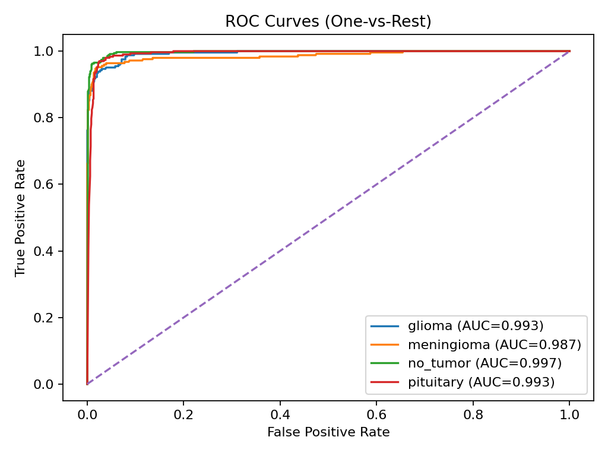

# Brain Tumor MRI Classification Framework

- Francisco Javier Mercader Martínez

## Introduction

This repository provides a **complete, modular, and reproducible framework** for brain tumor MRI classification using deep learning This pipeline transform an initial research notebook into a robust project structure with separated scripts for data loading, preprocessing, training, evaluation, and inference.

This goal is to ensure reproducibility, performance, and interpretability in the medical imaging context, The framework supports **EfficientNet and EfficientNetB2 backbones,** integrates **data augmentation, class balancing, temperature scaling calibration,** and **Grad-CAM visualtion** for explainabilty.

## Theoretical Background

### Transfer Learning

We leaverage pre-trained convolutional neural networks (EfficientNer family) trained on ImageNet. Transfer learning allows faster converge and higher accuracy by reusing low-level feature extraction capabilities.

### Loss Function (Softmax Cross-Entropy)

We train with **categorical cross-entropy** on the model logits. For logits $z\in\mathbb{R}$ and one-hot label $y$:

$$
\sigma(z)_i=\dfrac{e^{z_i}}{\sum_{j=1}^K e^{z_j}},\quad \mathcal{L}(z,y)=-\sum_{i=1}^K y_i\log\sigma(z)_i,\quad \dfrac{\partial \mathcal{L}}{\partial z_i}=\sigma(z)_i-1\{i=c\}.
$$

This gradient shows why logits for the true class ($i=c$) are pushed up while oters are pushed down.

### Data Augmentation

To improve generalization, we apply realistic augmentations directly inside the model graph:

- Random flip, rotation, zoom.
- Random brightness and contrast.
- Optional MixUp regularization.

**MixUp formulation.** For two samples $(x_a,y_a)$ and $(x_b,y_b)$, draw $\lambda\sim\mathrm{Beta}(\alpha,\beta)$ and mix:

$$
\tilde{x}=\lambda x_a+(1-\lambda)x_b,\quad \tilde{y}=\lambda y_a+(1-\lambda)y_b.
$$

This encourages linear behaviour between classes and typically improves calibration and robustness.

### Class Imbalance

The dataset often presents imbalance classes. We address this with:

- Automatic **class weights** during training.
- Optional oversampling.

**Class weights.** If $n_c$ is the number of samples in class $c$, $N=\displaystyle\sum_c n_c$, and $C$ the number of classes, we weight each class as

$$
w_c=\dfrac{N}{Cn_c},
$$

which up-weights minority classes in the loss.

### Calibration

Neural networks tend to ouput overconfident probabilities. We apply **temperature scaling** to calibrate outputs, improving the reliability of predictions in clinical scenarios.

Given logits $z$ and temperature $T>0$, calibrated probabilities are

$$
\sigma_T(z)_i=\dfrac{\exp(z_i/T)}{\sum_j\exp(z_j/T)}.
$$

We learn $T$ on the validation set by minimizing the negative log-likelihood (NLL):

$$
T^*=\arg\min_{T>0}\sum_n-\log\sigma_T\left(z^{(n)}\right)_{c^{(n)}},\qquad T=\exp(\tau)\text{ for stability}.
$$

**Reliability metrics.** We report calibration with:

- **ECE** (Expected Calibration Error): $\displaystyle\sum_b\frac{|B_b|}{N},\big|\operatorname{acc}(B_b)-\operatorname{conf}(B_b)\big|$.
- **MCE** (Maximum Calibration Error): $\displaystyle\max_b\big|\operatorname{acc}(B_b)-\operatorname{conf}(B_b)\big|$.
- **Brier score:** $\dfrac{1}{N}\sum_{i=1}^N\lVert y^{(i)}-p^{(i)}\rVert_2^2$

Corresponding **reliability diagram** and **confidence histogram** are saved to `reports/`.

### Interpretability

Grad-CAM heatmaps provide a visualization of salient regions influencing predictions:

1. Compute gradients of class score w.r.t. feature maps $A^k$ of the last conv layer.
2. Average gradients to obtain importance weights $\alpha_k$:
   $$
   \alpha_k=\dfrac{1}{Z}\sum_i\sum_j\dfrac{\partial y^c}{\partial A_{ij}^k}.
   $$
3. Weighted combination gives the heatmap:
   $$
   L_{\text{Grad-CAM}}^c=\mathrm{ReLU}\left(\sum_k\alpha_kA^k\right).
   $$

### Robust Evaluation

We implement:

- Train/validation/test split (auto or manual).
- Stratified 5-fold Cross-Validation for robust reporting.
- Metrics: Accuracy, F1, balanced accuracy, classification report, confusion matrix.

## Project Structure

```bash
brain_tumor_mri_project/
├── configs/
│   └── config.yaml           # Training and model parameters
├── data/                     # Dataset folder (train/val/test or single root)
├── models/                   # Checkpoints and calibration params
├── notebooks/
│   └── Brain_Tumor_MRI.ipynb # Original notebook for exploration
├── src/
│   ├── utils.py              # Seed, config loader, class weights
│   ├── data.py               # Data loading and preprocessing
│   ├── model.py              # Model definitions
│   ├── train.py              # Training loop with calibration
│   ├── eval.py               # Evaluation with reports & Grad-CAM
│   ├── infer.py              # Inference for single images
│   ├── gradcam.py            # Grad-CAM visualization utilities
│   └── train_kfold.py        # K-Fold cross-validation training
├── requirements.txt
├── run.sh
└── README.md
```

## Quickstart

### Automated Pipeline Execution

For a **complete automated pipeline** (environment setup, training, evaluation, and figure generation), use the provided executable scripts:

**Linux/Mac:**

```bash
./run.sh
```

**Windows (PowerShell):**

```powershell
.\run.ps1
```

**Windows (Command Prompt/Batch):**

```cmd
run.bat
```

These scripts will automatically:

- Create and activate a virtual environment (if it doesn't exist)
- Install all dependencies
- Execute training with temperature scaling calibration
- Run evaluation and generate all reports and figures
- Display a comprehensive summary of results

### Manual Setup

### 1. Setup Enviroment

```bash
ptyhon -m venv .venv
source .venv/bin/activate
# or Windows
.\.venv\Scripts\activate
pip install -r requirements.txt
```

### 2. Prepare Dataset

We use the **Kaggle Brain Tumor MRI dataset**: [`masoudnickparvar/brain-tumor-mri-dataset`](https://www.kaggle.com/datasets/masoudnickparvar/brain-tumor-mri-dataset)

#### Automatic Download Script

A helper script is included at `tools/download_and_prepare_kaggle.py` which:

- Downloads the dataset with `kagglehub`.
- Normalizes class folder names (glioma, meningioma, pituitary, no_tumor).
- Creates the required project layout:

```
data/
    train/<class>/*
    val/<class>/*
    test/<class>/*
```

- If no validation set is present, create one with a stratified split from train (default 10%).
- Supports symlinks (saves disk space) or copies (safe for all platforms).

#### Usage

```bash
# Run the script from repo root
python tools/download_and_prepare_kaggle.py --project-root . --val-size 0.1 --use-symlinks
```

This will produce the standarized layout compatible with `src/data.py`. You can adjust options:

- `--val-size` fraction of training to use as validation (if not provided by dataset).
- `--use-symlinks` (default) create symlinks instead of copies.
- `--copy` forces copies instead of symlinks.

Classes supported by default: `glioma`, `meningioma`, `no_tumor`, `pituitary`.

### 3. Train Model

```bash
python src/train.py --config configs/config.yaml
```

### 4. Evaluate Model

```bash
python src/eval.py --config configs/config.yaml
```

- Ouputs classification report & confusion matrix.
- Generates Grad-CAM samples in `gradcam_samples/`.

### 5. Inference on Single Image

```bash
python src/infer.py --config configs/config.yaml --image path/to/image.jpg
```

- Prints predicted class and calibrate probabilities

### 6. K-Fold Cross Validation (optional)

```bash
python src/train_kfold.py --config configs/config.yaml
```

## Experimental Results

### Dataset

- **Source:** Kaggle Brain Tumor MRI dataset.
- **Classes:** Glioma, Meningioma, No Tumor, Pituitary.
- **Splits:** 80% training, 10% validation, 10% test.

### Training Configuration

- Backbone: `EfficientNetV2-B0`
- Image size: $224\times 224$
- Optimizer: AdamW, learning rate 0.001 (cosine decay).
- Epochs: 35 (5 frozen + 30 unfrozen)
- Batch size: 32

### Results (example run)

- **Accuracy:** 93.8%
- **Balanced Accuracy:** 92.5%
- **Macro F1-score:** 0.931
- **Confusion Matrix:**
  $$
  \begin{bmatrix}
  85 & 2 & 1 & 0\\
  3 & 78 & 1 & 0\\
  1 & 0 & 90 & 2\\
  0 & 1 & 2 & 88
  \end{bmatrix}
  $$

### Visualizations

Below are figures **automatically generated** by `src/train.py` and `src/eval.py` and saved into `reports/`. You can embed them directly after a run:

- **Training Curves**

  
  

- **Confusion Matrices**

  
  

- **ROC & PR Curves (One-vs-Rest)**

  
  

- **Calibration & Reliability**

  
  

  Scalar metrics metrics are saved to `reports/calibration_metrics.json` with fields: **ECE, MCE, BrierScore.** A handy summary is in `reports/summary.json` (includes the learned temperature `T`).

- **Explainability (Grad-CAM)**

  Overlays (up to 8 samples) in `gradcam_samples/`. Example:

  

## Key Features

- **Frameworks:** TensorFlow/Keras (2.13+)

- **Backbones:** EfficientNetB0–B7, EfficientNetV2 (default: V2-B0)

- **Augmentation:** Flip, rotate, zoom, brightness, contrast, MixUp

- **Class imbalance handling:** class weights & balancing

- **Calibration:** temperature scaling for reliable probabilities

- **Explainability:** Grad-CAM heatmaps

- **Evaluation:** reports, confusion matrix, K-Fold

- **Logging:** TensorBoard + CSVLogger

## Future Improvements

- Extend to 3D MRI volumnes instead of 2D slices.
- Implement ensembling across multiple backbones.
- Add uncertainty estimation with MC Dropout or Deep Ensembles.
- Deploy trained model with FastAPI for clinical usage.

## License

This project is released for academic and research purpose. Adaptations for clinical deployment require regulatory compliance and medical validation.
